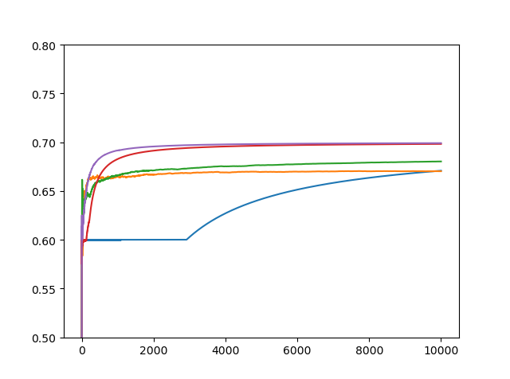

**画出四种算法在解决2-arms问题的不同轮数t下，平均累积reward的图像**

+ **均匀探索算法**

  + 探索优先算法
  + $\epsilon$-固定贪心算法
  + $\epsilon$-衰减贪心算法

  ```python
  import numpy as np
  import matplotlib.pyplot as plt
  import math
  
  
  # reward:假设一个arm的reward分布服从伯努利分布
  R = np.array([0.5, 0.6, 0.7])
  
  K = 3  # arm数量K
  T = 10000  # 总轮次T
  # 探索过程的每个arm被选择次数N
  N = int(math.pow(T, 2/3)*math.pow(math.log(T), 1/3))
  
  
  def argmax(Q, K):
      amax = 0
      for i in range(K):
          if Q[amax] < Q[i]:
              amax = i
      return amax
  
  
  def exploreFirst():
      sum_reward = np.zeros(T + 1)  # 总奖赏
      mean_reward = np.zeros(T + 1)  # 平均奖赏
      Q = np.zeros(K)  # 每个arm的平均奖赏
      count = np.zeros(K)  # 每个arm被选则的次数  
      # 探索过程
      for t in range(K * N):
          sum_reward[t + 1] = sum_reward[t] + R[t % K]
          mean_reward[t + 1] = sum_reward[t + 1] / (t + 1)
      # 每个arm的平均奖赏
      for k in range(K):
          Q[k] = (R[k] * N) / (K * N)
      # 选出最大arm的序号
      amax = argmax(Q, K)
  
      for t in range(K * N, T):
          sum_reward[t + 1] = sum_reward[t] + R[amax]
          mean_reward[t + 1] = sum_reward[t + 1] / (t + 1)
      x = np.arange(T + 1)
      y = mean_reward
      plt.plot(x, y)
  
  
  def epsilonFixedGreedy():
      sum_reward = np.zeros(T + 1)  # 总奖赏
      mean_reward = np.zeros(T + 1)  # 平均奖赏
      Q = np.zeros(K)  # 每个arm的平均奖赏
      count = np.zeros(K)  # 每个arm被选则的次数
      e = K * N / T  # 固定的epsilon
      for t in range(T):
          if np.random.rand() < e:
              k = np.random.randint(0, K)
          else:
              k = argmax(Q, K)
          sum_reward[t + 1] = sum_reward[t] + R[k]
          mean_reward[t + 1] = sum_reward[t + 1] / (t + 1)
          Q[k] = (Q[k] * count[k] + R[k]) / (count[k] + 1)
          count[k] = count[k] + 1
      x = np.arange(T + 1)
      y = mean_reward
      plt.plot(x, y)
  
  
  def epsilonDacayGreedy():
      sum_reward = np.zeros(T + 1)  # 总奖赏
      mean_reward = np.zeros(T + 1)  # 平均奖赏
      Q = np.zeros(K)  # 每个arm的平均奖赏
      count = np.zeros(K)  # 每个arm被选则的次数
      for t in range(T):
          # 衰减的epsilon
          e = math.pow(t + 1, -1 / 3) * math.pow(K * math.log(t + 1), 1 / 3)
          if np.random.rand() < e:
              k = np.random.randint(0, K)
          else:
              k = argmax(Q, K)
          sum_reward[t + 1] = sum_reward[t] + R[k]
          mean_reward[t + 1] = sum_reward[t + 1] / (t + 1)
          Q[k] = (Q[k] * count[k] + R[k]) / (count[k] + 1)
          count[k] = count[k] + 1
      x = np.arange(T + 1)
      y = mean_reward
      plt.plot(x, y)
  
  if __name__ == '__main__':
      fig = plt.figure()
      exploreFirst()
      epsilonFixedGreedy()
      epsilonDacayGreedy()
      plt.show()
  ```

  

  蓝色是探索优先算法，黄色是$\epsilon$-固定贪心算法，绿色是$\epsilon$-衰减贪心算法

+ **自适应算法**
  
  + 连续淘汰算法
  + UCB1算法
  
  


