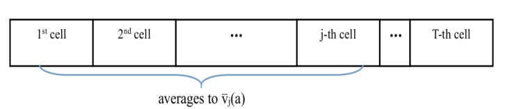

**Stochastic Bandits**

+ **名词解释**
  + Stochastic：随机的
  + regret：遗憾
  + uniform exploration：均匀探索
  + adaptive exploration：自适应探索

**1.Model and examples**

+ 符号说明1：
  + arm的数量为$K.$
  + arm的序号为$a.$
  + 选择的轮数为$T.$
  + 第$t$轮选择序号为$a_t$的arm的reward为$r_t\in [0,1].$
+ M-a bandits问题定义：每一轮选择一个arm，如何使累积的reward最大？
+ 基本假设
  + ①该问题属于bandit feedback。
  + ②每一次arm下的reward之间是IID的。
  + ③每轮的reward是有限的，为了简单将reward限制在[0,1]。
+ 符号说明2：
  + $K$个arm的reward组成向量$\mu \in [0,1]^{K}.$
  + 序号为$a$的arm的平均reward为$\mu(a) = E[D_a].$标量
  + reward分布表示为$D_a.$
+ 伯努利分布
  + 定义：事件成功概率为1，否则概率为0，又称为两点分布或者0-1分布。这是最简单的reward分布。
  + 期望：$E[X]=p.$ 当reward分布是伯努利分布时，序号为$a$的arm的平均reward就等于$p.$

+ 符号说明3：

  + arm序号为$a$，数量为$K$，arm的集合为$A.$
  + 轮序为$t$，轮数为$T$。
  + 序号为$a$的arm的期望reward为$\mu(a) = E[D_a]$
  + 序号为$a$的最大reward为$\mu^{*} = \max\limits_{a\in A}\mu(a).$
  + 最大reward和平均rewad的差值为$\Delta(a)=\mu^{*}-\mu(a)$，又称为序号$a$的arm的gap.
  + 最大reward对应的arm的序号为$a^{*}.$
  + 集合$\{1,2,...,n\}$表示为$[n].$

+ 给定多个问题实例，如何对比评价一个M-a bandits算法的好坏？

  + 比较算法的累积sum(reward)和最优arm基准$\mu^{*}\cdot T$，计算$T$轮后的regret。

  + 公式
    $$
    R(T)=\mu^{*} \cdot T-\sum_\limits{t=1}^{T} \mu\left(a_{t}\right)
    $$

  + 说明：在第$t$轮选择的arm时随机的，所以$R(T)$是一个随机变量。通常讨论期望$E[R(T)].$

+ $R(T)$和$E[R(T)]$的区别

  + $R(T)$表示已发生的累积regret，有时也称pseudo-reget.
  + $E[R(T)]$表示期望regret.

**2.Simple algorithms: uniform exploration**

+ **Explore-First算法**

  ```
  1.探索过程:每个arm选择N次。
  2.选择平均reward最大的arm，记作amax。
  3.利用过程:剩下的轮次都选择amax。
  ```

  + **clean事件**

    + clean事件满足下面霍夫丁不等式的arm事件，又称为高概率事件。

    + 符号说明：

      >+ 探索过程选择arm的平均reward为$\bar{\mu}(a).$
      >+ 序号为$a$的arm的期望reward为$\mu(a) = E[D_a]$.
      >
      >+ 序号为$a$的arm的置信半径为$r(a)$
      >+ 探索过程选择每个arm的次数为$N$
      >+ 总过程选择的轮数为$T$.

    + 公式：

      >$$
      >\begin{align}
      >& r(a)=\sqrt{\frac{2 \log T}{N}}\\
      >& \operatorname{Pr}\{|\bar{\mu}(a)-\mu(a)| \leq r(a)\} \geq 1-\frac{2}{T^{4}}
      >\end{align}
      >$$

    

  + **算法分析—计算regret上界**

    假设探索过程的动作都是clean事件，当$N$为多少时，总过程regret增加的最少？

    >**符号说明：arm数量为$K$，最优arm为$a^{*}$。**
    >
    >**1.当$K=2$**
    >
    >**如果通过算法选择了不是最优arm的$a$，那么$\bar{\mu}(a)>\bar{\mu}\left(a^{*}\right)$成立。**
    >
    >**因为是clean事件，所以$\mu(a)+r(a) \geq \bar{\mu}(a)>\bar{\mu}\left(a^{*}\right) \geq \mu\left(a^{*}\right)-r\left(a^{*}\right)$成立。**
    >
    >**化简得到：$\mu\left(a^{*}\right)-\mu(a) \leq r(a)+r\left(a^{*}\right)=O(\sqrt{\frac{\log T}{N}})$.**
    >
    >**所以**
    >
    >+ **利用过程每轮增加regret的最多为$O(\sqrt{\frac{\log T}{N}})$.**
    >
    >+ **利用过程的轮数为$T-KN=T-2N$**.
    >
    >+ **利用过程累积的regret上限为$O(\sqrt{\frac{\log T}{N}} \times (T-2N))$.**
    >
    >+ **探索过程每轮增加的regret最多为$1$**
    >+ **探索过程累积的regret上限为$N$.**
    >
    >+ **探索过程+利用过程的regret的上界为**
    >
    >$$
    >\begin{aligned}
    >R(T) & \leq N+O(\sqrt{\frac{\log T}{N}} \times(T-2 N)) \\
    >& \leq N+O(\sqrt{\frac{\log T}{N}} \times T)
    >\end{aligned}
    >$$
    >
    >**因为$N$递增，$\sqrt{\frac{\log T}{N}} \times T$递减，为了使不等式右边最小，让二者趋于相等，令$N=T^{2 / 3}(\log T)^{1 / 3}$，**
    >
    >**得到**
    >$$
    >R(T) \leq O\left(T^{2 / 3}(\log T)^{1 / 3}\right)
    >$$
    >**regret的期望为**
    >$$
    >\begin{aligned}
    >&E [R(T)]= E [R(T) | \text { clean event }] \times \operatorname{Pr}[\text { clean event }]\\
    >&\begin{aligned}
    >&+ E [R(T) | \text { bad event }] \times \operatorname{Pr}[\text { bad event }] \\
    >\leq & E [R(T) | \text { clean event }]+T \times O\left(T^{-4}\right) \\
    >\leq & O\left(\sqrt{\log T} \times T^{2 / 3}\right)
    >\end{aligned}
    >\end{aligned}
    >$$
    >**end proof.**
    >
    >**2.当K>2时**
    >
    >**探索过程每轮增加的regret最多为$K$，累积regret的上限为$KN$.**
    >
    >**与$K=2$的证明方式相似，令$N=(T / K)^{2 / 3} \cdot O(\log T)^{1 / 3}$，得到**
    >$$
    >E [R(T)] \leq T^{2 / 3} \times O(K \log T)^{1 / 3}
    >$$
    >**end proof 2.**
+ **$\epsilon$-贪心算法**

  ```
  for each round t = 1,2,...,T do
  	if rand([0,1]) < epsilon then
  		explore
  	else
  		exploit
  	end if
  end for
  ```

  + **算法分析—$\epsilon$衰减分析**
    + 当$\epsilon_t$与$ \frac{1}{t^{1/3}}$成正比，探索需要的轮次大约为$t^{\frac{2}{3}}$，随着轮次的增加，探索概率下降。
  + **算法分析—计算regret上界**
    + 令$\epsilon_{t}=t^{-1 / 3} \cdot(K \log t)^{1 /3}$，第$t$轮regret的上界为$E [R(t)] \leq t^{2 / 3}\cdot O(K \log t)^{1 /3}$。
  
+ **探索优先算法和$\epsilon$-贪心算法的区别和联系**

  + 探索优先算法
  + $\epsilon$固定-贪心算法，如果$\epsilon=\frac{KN}{T}$，那么和探索优先算法有什么区别？
  + $\epsilon$衰减-贪心算法
  + 以上算法的缺点：只考虑了arm的的reward，没有考虑arm被探索的rounds。

**3.Advanced algorithms: adaptive exploration**

+ **clean事件和置信界**

  + 名词解释

    + clean事件：满足霍夫丁不等式的动作。
    + 置信区间：由样本统计量构成的总体参数的估计区间。
    + 样本：从全体中随机抽取的个体。
    + 统计量：样本集合的属性，例如均值和方差。
    + 总体参数：描述总体的属性，例如均值和方差。
    + 置信界：置信区间的上界和下界。

  + 符号说明：

    + 固定轮次为$t$.
    + arm的序号为$a$.
    + 从第$1$轮到第$t$轮中选择的序号为$a$的arm的数量为$n_t(a)$.
    + 序号为$a$的arm的到第$t$轮选择后的平均reward为$\bar{\mu}_{t}(a)$.
    + 序号为$a$的arm在第$t$轮的置信半径为$r_t(a)$.

  + $n_t(a)$是一个随机变量，如何证明带有随机变量的霍夫丁不等式？

    + $$
      \begin{align}
      & r_t(a)=\sqrt{\frac{2 \log T}{n_t(a)}}\\
      & \operatorname{Pr}\{|\bar{\mu}(a)-\mu(a)| \leq r_t(a)\} \geq 1-\frac{2}{T^{4}}
      \end{align}
      $$

  + 假设每个arm $a$对应一个reward tape

    + 

    + cell的序号为$j\in [1,T]$.

    + 当$n_t(a)=j$时对应的平均reward为$\bar{v}_j(a)$，其实$j$可能大于$n_t(a)=j$.

    + 根据霍夫丁不等式得到

      + $$
        \forall j \quad \operatorname{Pr}\left(\left|\bar{v}_{j}(a)-\mu(a)\right| \leq r_{t}(a)\right) \geq 1-\frac{2}{T^{4}}\\
        \operatorname{Pr}\left(\forall a \forall j \quad\left|\bar{v}_{j}(a)-\mu(a)\right| \leq r_{t}(a)\right) \geq 1-\frac{2}{T^{2}}\\
        E :=\left\{\forall a \forall t \quad\left|\bar{\mu}_{t}(a)-\mu(a)\right| \leq r_{t}(a)\right\}\\
        \operatorname{Pr}[ E ] \geq 1-\frac{2}{T^{2}}\\
        \operatorname{UCB}_{t}(a) =\bar{\mu}_{t}(a)+r_{t}(a) \\
        \operatorname{LCB}_{t}(a) =\bar{\mu}_{t}(a)-r_{t}(a)\\
        \left[ LCB _{t}(a) ; UCB _{t}(a)\right]称为置信区间.
        $$

      + 满足上面不等式称为clean事件。

+ **连续淘汰算法**
  
+ **2-arms 淘汰算法。**
  
    ```
    1.探索：交替选择两个arm，直到UCB[t][a1]<LCB[t][a2];
    2.利用：丢弃a1,只选择a2.
  ```
  
  + 算法分析—计算regret上界。（假设每个事件都是clean事件）
  
    >$$
    >\Delta:=\left|\mu(a)-\mu\left(a^{\prime}\right)\right| \leq 2\left(r_{t}(a)+r_{t}\left(a^{\prime}\right)\right)\\
    >\Delta \leq 2\left(r_{t}(a)+r_{t}\left(a^{\prime}\right)\right) \leq 4 \sqrt{\frac{2 \log T}{\lfloor t / 2\rfloor}}=O(\sqrt{\frac{\log T}{t}})\\
    >R(t) \leq \Delta \times t \leq O(t \cdot \sqrt{\frac{\log T}{t}})=O(\sqrt{t \log T})\\
    >\begin{aligned}
    >E [R(t)]=& E [R(t) | \text { clean event }] \times \operatorname{Pr}[\text { clean event }] \\
    >&+ E [R(t) | \text { bad event }] \times \operatorname{Pr}[\text { bad event }] \\
    >\leq & E [R(t) | \text { clean event }]+t \times O\left(T^{-2}\right) \\
    >\leq & O(\sqrt{t \log T})
    >\end{aligned}
  >$$
  
+ **连续淘汰算法**
  
    ```
    1.探索
    初始化所有arm，状态都是"active";
    while(true):
    	轮流选择所有的arm a;
    	如果存在a，满足UCB[t][a'] < LCB[t][a]:
    		a的状态为"dead";
    	如果只剩一个a:
    		amax=a;
  		break;
    2.利用
  只选择amax。
    ```
  
    + 算法分析—计算regret上界。(假设都是clean事件)
  
      >**符号说明：**
      >
      >>+ **最优arm为$a^{*}$**
      >>+ **即将失效其他arm为$a$**
      >>+ **最优arm $a*$的reward期望为$\mu(a^{*})$**
      >>+ **其他arm的reward期望为$\mu(a)$**
      >>+ **序号为$a$的arm在第$t$轮的置信半径为$r_t(a)$.**
      >>+ **最优arm和其他arm的reward期望的差值为$\Delta(a)$**
      >>+ **从第$1$轮到第$t$轮中选择的序号为$a$的arm的数量为$n_t(a)$.**
      >>+ **$K$个arm组成的集合为$A$。**
      >>+ **满足$\mu(a)<\mu(a^{*})$的集合为$A^+$，里面全是即将失效的$a$。**
      >>+ **第$t$轮序号为$a$的arm累积的regret为$R(t;a)$。**
      >>+ **第$t$轮所有非最优arm累积的Regret为$R(t)$**
      >
      >**计算regret：**
      >
      >**方法一：**
      >$$
      >假设前t轮都是clean事件\\
      >\Delta(a):=\mu\left(a^{*}\right)-\mu(a) \leq 2\left(r_{t}\left(a^{*}\right)+r_{t}(a)\right)=O\left(r_{t}(a)\right)\\
      >n_t(a)=n_T(a)，r_t(a)=r_T(a)\\
      >对于\mu(a)<\mu(a^{*})，满足\Delta(a) \leq O\left(r_{T}(a)\right)=O(\sqrt{\log (T) / n_{T}(a)})\\
      >R(t ; a)=n_{t}(a) \cdot \Delta(a) \leq n_{t}(a) \cdot O(\sqrt{\log T / n_{t}(a)})=O(\sqrt{n_{t}(a) \log T}\\
      >\begin{aligned}
      >R(t)=\sum_{a \in A ^{+}} R(t ; a) &=O(\sqrt{\log T}) \sum_{a \in A ^{+}} \sqrt{n_{t}(a)} \\
      >& \leq O(\sqrt{\log T}) \sum_{a \in A } \sqrt{n_{t}(a)}
      >\end{aligned}\\
      >因为f(x)=\sqrt{x}是凹函数，且\sum_{a \in A } n_{t}(a)=t，根据杰森不等式得到\\
      >\frac{1}{K} \sum_{a \in A } \sqrt{n_{t}(a)} \leq \sqrt{\frac{1}{K} \sum_{a \in A } n_{t}(a)}=\sqrt{\frac{t}{K}}\\
      >代入前面的R(t)，得到\\
      >R(t) \leq O(\sqrt{K t \log T})\\
      >E [R(t)]=O(\sqrt{K t \log T})
      >$$
      >**方法二：**
      >$$
      >假设前t轮都是clean事件\\
      >\Delta(a):=\mu\left(a^{*}\right)-\mu(a) \leq 2\left(r_{t}\left(a^{*}\right)+r_{t}(a)\right)=O\left(r_{t}(a)\right)\\
      >n_t(a)=n_T(a)，r_t(a)=r_T(a)\\
      >对于\mu(a)<\mu(a^{*})，满足\Delta(a) \leq O\left(r_{T}(a)\right)=O(\sqrt{\log (T) / n_{T}(a)})\\
      >n_{T}(a) \leq O\left(\frac{\log T}{[\Delta(a)]^{2}}\right)\\
    >R(T ; a)=\Delta(a) \cdot n_{T}(a) \leq \Delta(a) \cdot O\left(\frac{\log T}{[\Delta(a)]^{2}}\right)=O\left(\frac{\log T}{\Delta(a)}\right)\\
      >R(T) \leq O(\log T)\left[\sum_{a \in A ^{+}} \frac{1}{\Delta(a)}\right]\\
    >E [R(T)] \leq O(\log T)\left[\sum_{\operatorname{arms} a \text { with } \mu(a)<\mu\left(a^{*}\right)} \frac{1}{\mu\left(a^{*}\right)-\mu(a)}\right]
      >$$
  
  + 说明：

    + 连续消除算法是自适应探索算法，相比非自适应探索算法，regret的上界是log的。
    + regret上界形式为$C\cdot f(T)$，$f(\cdot)$与$\mu$无关，$C$与$T$无关。如果$C$和$\mu$无关，称为独立实例；否成称为依赖实例。
    + remark1.6说明第二种求regret的方法的改进，将$\Delta(a)$替换掉，得到$R(T) \leq O(\sqrt{K T \log T})$.
  
+ **不确定性的乐观主义**

  + UCB1算法

    ```
    选择每一个arm一次;
    在每一轮t,选择最大的UCB[t][a]对应的arm a,其中UCB[t][a]=mubar[t][a]+r[t][a];
    ```

  + 算法分析—理解UCB公式
    $$
    UCB_t(a)=\bar{\mu}_t(a)+r_{t}(a)=\bar{\mu}_{t}(a)+\sqrt{\frac{2 \log T}{n_t(a)}}\\
    $$
    如果$a$在第$t$轮的$UCB_t(a)$最大：

    ​	情况1：$a$的平均reward很大，即$\bar{\mu}_{t}(a)$很大。相当于利用。

    ​	情况2：$a$的置信半径$r_{t}(a)$很大，即$a$被选择的次数很少，即$n_t(a)$很小。相当于探索。

  + 算法分析—计算regret上界

    >+ 符号说明
    >
    >  >**最优arm为$a^{*}$**
    >  >
    >  >**最优arm $a*$的reward期望为$\mu(a^{*})$**
    >  >
    >  >**其他arm的reward期望为$\mu(a)$**
    >  >
    >  >**序号为$a$的arm在第$t$轮的置信半径为$r_t(a)$.**
    >  >
    >  >**最优arm和其他arm的reward期望的差值为$\Delta(a)$**
    >  >
    >  >**从第$1$轮到第$t$轮中选择的序号为$a$的arm的数量为$n_t(a)$.**
    >  >
    >  >**第$t$轮选择后arm $a$的置信度是$UCB_t(a)$**
    >
    >+ regret推导
    >
    >$$
    >UCB _{t}\left(a_{t}\right) \geq UCB _{t}\left(a^{*}\right)\\
    >\mu\left(a_{t}\right)+r_{t}\left(a_{t}\right) \geq \bar{\mu}_{t}\left(a_{t}\right)\\
    >\operatorname{UCB}_{t}\left(a^{*}\right) \geq \mu\left(a^{*}\right)\\
    >\mu\left(a_{t}\right)+2 r_{t}\left(a_{t}\right) \geq \bar{\mu}_{t}\left(a_{t}\right)+r_{t}\left(a_{t}\right)=\operatorname{UCB}_{t}\left(a_{t}\right) \geq \operatorname{UCB}_{t}\left(a^{*}\right) \geq \mu\left(a^{*}\right)\\
    >\Delta\left(a_{t}\right):=\mu\left(a^{*}\right)-\mu\left(a_{t}\right) \leq 2 r_{t}\left(a_{t}\right)=2 \sqrt{\frac{2 \log T}{n_{t}\left(a_{t}\right)}}\\
    >E [R(t)]=O(\sqrt{K t \log T})\\
    >E [R(T)] \leq O(\log T)\left[\sum_{\operatorname{arms} a \text { with } \mu(a)<\mu\left(a^{*}\right)} \frac{1}{\mu\left(a^{*}\right)-\mu(a)}\right]
    >$$
    >
    >

**4.Forward look: bandits with initial information**

+ 对$\mu$的约束：

  + 线性函数：$\mu(a)=w\cdot a，w\in \R^{d}$。

  + 凹性函数：$\mu^{''}(\cdot)$存在且为负。

  + 利普席茨函数：对于所有的arm满足$\left|\mu(a)-\mu\left(a^{\prime}\right)\right| \leq L \cdot\left\|a-a^{\prime}\right\|_{2}$，其中$L$为常数。

  + 说明：通过这些约束可以观察其他arm的reward来推断某个arm $a$的平均reward，其中线性和凸性是距离$a$较远的其他arm对$a$的影响，李普希兹函数是距离$a$较近的其他arm对$a$的影响。

  + 注意：加上约束后的效果不一定好。
+ 贝叶斯bandits.
  + mark.

**5.总结**

+ 均匀探索算法
  + 探索优先算法
  + $\epsilon$-固定贪心算法
  + $\epsilon$-衰减贪心算法
+ 自适应探索算法
  + 连续消除算法
  + UCB1算法
+ 均匀探索算法和自适应探索算法的区别：
  + 均匀探索算法只考虑的arm的平均reward($\bar{\mu}_t(a)$)，没有考虑arm被探索的次数。
  + 自适应探索算法不仅考虑arm的平均reward($\bar{\mu}_t(a)$)，还考虑了arm被探索的次数($r_t(a)$)。
+ 探索优先算法和$\epsilon$-固定贪心算法的区别：
+ $\epsilon$-固定贪心算法和$\epsilon$-衰减贪心算法的区别：
+ 连续消除算法和UCB算法的区别：
  + UCB算法不需要计算LCB。

