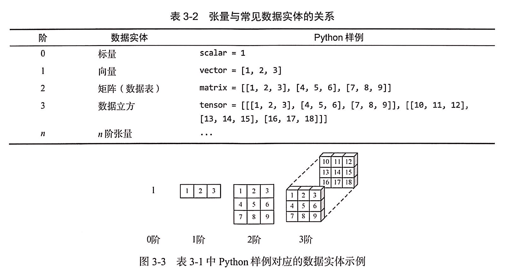
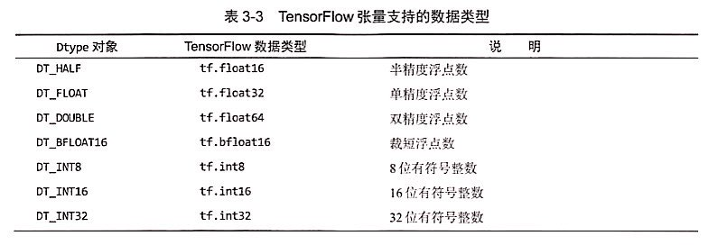
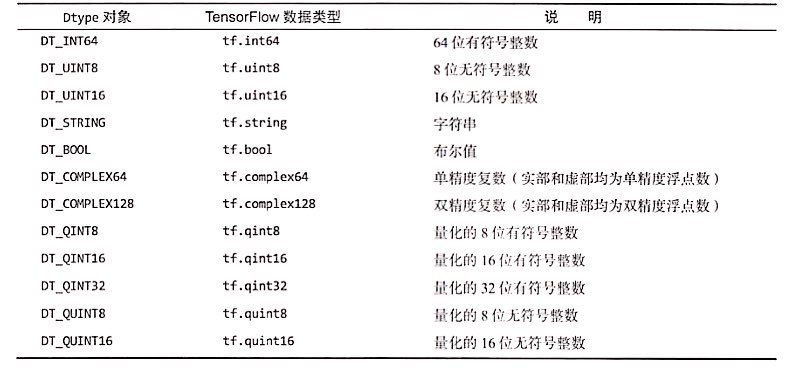
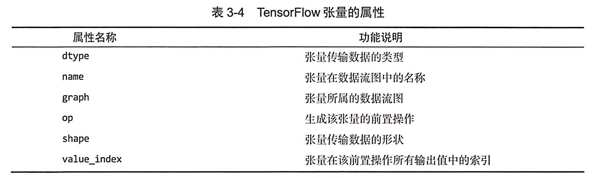
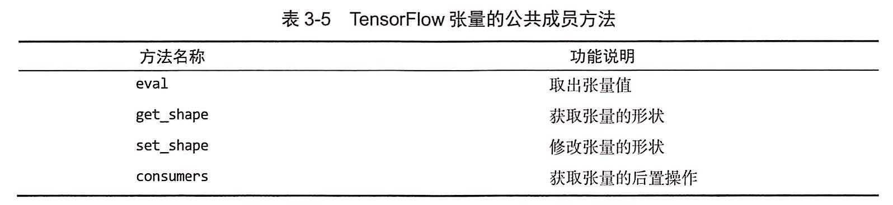
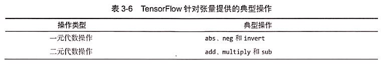
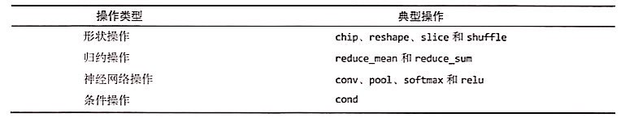

#### 1.张量：Tensor

+ 数组的维数表示对应张量的阶数。
+ 逻辑定义是数据载体，物理实现是句柄（编号），存储张量的元信息和指向张量数据的内存缓冲区指针，实现内存复用。

#### 2.张量与常见数据实体的关系



#### 3.张量支持的数据类型





#### 4.张量的属性



#### 5.创建张量

+ 一般情况下，不需要使用Tensor类的构造方法直接创建，而是通过操作间接创建张量。
+ 典型张量创建：常量定义操作和代数计算操作。

+ **Code**

```
import tensorflow as tf
import os
os.environ['TF_CPP_MIN_LOG_LEVEL'] = '2'

a1 = tf.constant([-1, -2, -3])

print("a1=",a1)
print("张量传输数据的类型：",a1.dtype)
print("张量在数据流图中的名称：",a1.name)
print("张量所属的数据流图：",a1.graph)
print("生成该张量的前置操作：\n",a1.op)
print("张量传输数据的形状：",a1.shape)
print("张量在该前置操作所有输出值中的索引：",a1.value_index)
```

+ **Output**

```
a1= Tensor("Const:0", shape=(3,), dtype=int32)
张量传输数据的类型： <dtype: 'int32'>
张量在数据流图中的名称： Const:0
张量所属的数据流图： <tensorflow.python.framework.ops.Graph object at 0x000001D4A5448D30>
生成该张量的前置操作：
 name: "Const"
op: "Const"
attr {
  key: "dtype"
  value {
    type: DT_INT32
  }
}
attr {
  key: "value"
  value {
    tensor {
      dtype: DT_INT32
      tensor_shape {
        dim {
          size: 3
        }
      }
      tensor_content: "\377\377\377\377\376\377\377\377\375\377\377\377"
    }
  }
}

张量传输数据的形状： (3,)
张量在该前置操作所有输出值中的索引： 0
```

#### 6.求解张量

+ 数据流图中的操作输出值由张量承载，如果想要求解特定张量的值需要创建会话Session。

+ **Code**

```
import tensorflow as tf
import os
os.environ['TF_CPP_MIN_LOG_LEVEL'] = '2'

a1 = tf.constant([-1, -2, -3])

with tf.Session() as sess:
    print("取出张量值：",a1.eval())
    print("获取张量的形状：", a1.get_shape())
    print("获取张量的后置操作：",a1.consumers())
```

+ **Output**

```
取出张量值： [-1 -2 -3]
获取张量的形状： (3,)
获取张量的后置操作： []
```

#### 7.张量的公共成员方法



#### 8.张量的操作





+ **Code0：0阶常数张量(标量)的代数操作**

```
import tensorflow as tf
import os
os.environ['TF_CPP_MIN_LOG_LEVEL'] = '2'

print("0阶常数张量")
# 创建0阶常数张量-标量
a1 = tf.constant(-1)
a2 = tf.constant(-2)
#一元代数操作：绝对值、相反数
a3 = tf.abs(a1)
a4 = tf.negative(a2)
#二元代数操作：加法、减法、乘法
a5 = tf.add(a1, a2)
a6 = tf.subtract(a1, a2)
a7 = tf.multiply(a1, a2)

with tf.Session() as sess:
    print("a1=%s,a2=%s" % (a1.eval(),a2.eval()))
    print("a3=|a1|=%s" % a3.eval())
    print("a4=-a2=%s" % a4.eval())
    print("a5=a1+a2=%s" % a5.eval())
    print("a6=a1-a2=%s" % a6.eval())
    print("a7=a1*a2=%s" % a7.eval())
    print("0阶张量a1形状：%s" % a1.get_shape())
    print("a1后置操作：\n%s" % a1.consumers())
```

+ **Output0**

```
0阶常数张量
a1=-1,a2=-2
a3=|a1|=1
a4=-a2=2
a5=a1+a2=-3
a6=a1-a2=1
a7=a1*a2=2
0阶张量a1形状：()
a1后置操作：
[<tf.Operation 'Abs' type=Abs>, <tf.Operation 'Add' type=Add>, <tf.Operation 'Sub' type=Sub>, <tf.Operation 'Mul' type=Mul>]
```

+ **Code1：1阶常数张量(向量)的代数操作**

```
import tensorflow as tf
import os
os.environ['TF_CPP_MIN_LOG_LEVEL'] = '2'

print("1阶常数张量")
# 创建1阶常数张量-向量
a1 = tf.constant([-1, -2, -3])
a2 = tf.constant([-3, -2, -1])
#一元代数操作：绝对值、相反数
a3 = tf.abs(a1)
a4 = tf.negative(a2)
#二元代数操作：加法、减法、乘法
a5 = tf.add(a1, a2)
a6 = tf.subtract(a1, a2)
a7 = tf.multiply(a1, a2)

with tf.Session() as sess:
    print("a1=%s" % a1.eval())
    print("a2=%s" % a2.eval())
    print("a3=|a1|=%s" % a3.eval())
    print("a4=-a2=%s" % a4.eval())
    print("a5=a1+a2=%s" % a5.eval())
    print("a6=a1-a2=%s" % a6.eval())
    print("a7=a1*a2=%s" % a7.eval())
    print("1阶张量a1的形状：%s" % a1.get_shape())
```

+ **Output1**

```
1阶常数张量
a1=[-1 -2 -3]
a2=[-3 -2 -1]
a3=|a1|=[1 2 3]
a4=-a2=[3 2 1]
a5=a1+a2=[-4 -4 -4]
a6=a1-a2=[ 2  0 -2]
a7=a1*a2=[3 4 3]
1阶张量a1的形状：(3,)
```

+ **Code2：2阶常数张量(矩阵)的代数操作**

```
import tensorflow as tf
import os
os.environ['TF_CPP_MIN_LOG_LEVEL'] = '2'

print("2阶常数张量")
# 创建2阶常数张量-矩阵
a1 = tf.constant([[-1, -2, -3], [-4, -5, -6], [-7, -8, -9]])
a2 = tf.constant([[-9, -8, -7], [-6, -5, -4], [-3, -2, -1]])
#一元代数操作：绝对值、相反数
a3 = tf.abs(a1)
a4 = tf.negative(a2)
#二元代数操作：加法、减法、乘法
a5 = tf.add(a1, a2)
a6 = tf.subtract(a1, a2)
a7 = tf.multiply(a1, a2)

with tf.Session() as sess:
    print("a1=%s" % a1.eval())
    print("a2=%s" % a2.eval())
    print("a3=|a1|=\n%s" % a3.eval())
    print("a4=-a2=\n%s" % a4.eval())
    print("a5=a1+a2=\n%s" % a5.eval())
    print("a6=a1-a2=\n%s" % a6.eval())
    print("a7=a1*a2=\n%s" % a7.eval())
    print("2阶张量a1形状：%s" % a1.get_shape())
```

+ **Output2**

```
2阶常数张量
a1=[[-1 -2 -3]
 [-4 -5 -6]
 [-7 -8 -9]]
a2=[[-9 -8 -7]
 [-6 -5 -4]
 [-3 -2 -1]]
a3=|a1|=
[[1 2 3]
 [4 5 6]
 [7 8 9]]
a4=-a2=
[[9 8 7]
 [6 5 4]
 [3 2 1]]
a5=a1+a2=
[[-10 -10 -10]
 [-10 -10 -10]
 [-10 -10 -10]]
a6=a1-a2=
[[ 8  6  4]
 [ 2  0 -2]
 [-4 -6 -8]]
a7=a1*a2=
[[ 9 16 21]
 [24 25 24]
 [21 16  9]]
2阶张量a1形状：(3, 3)
```

**Code3：3阶常数张量(矩阵)的代数操作**

```
import tensorflow as tf
import os
os.environ['TF_CPP_MIN_LOG_LEVEL'] = '2'

print("3阶常数张量")
# 创建3阶常数张量-数据立方
a1 = tf.constant([[[-1, -2, -3], [-4, -5, -6], [-7, -8, -9]], [[-11, -12, -13], [-14, -15, -16], [-17, -18, -19]]])
a2 = tf.constant([[[-19, -18, -17], [-16, -15, -14], [-13, -12, -11]], [[-9, -8, -7], [-6, -5, -4], [-3, -2, -1]]])
#一元代数操作：绝对值、相反数
a3 = tf.abs(a1)
a4 = tf.negative(a2)
#二元代数操作：加法、减法、乘法
a5 = tf.add(a1, a2)
a6 = tf.subtract(a1, a2)
a7 = tf.multiply(a1, a2)

with tf.Session() as sess:
    print("a1=%s" % a1.eval())
    print("a2=%s" % a2.eval())
    print("a3=|a1|=\n%s" % a3.eval())
    print("a4=-a2=\n%s" % a4.eval())
    print("a5=a1+a2=\n%s" % a5.eval())
    print("a6=a1-a2=\n%s" % a6.eval())
    print("a7=a1*a2=\n%s" % a7.eval())
    print("3阶张量a1形状：%s" % a1.get_shape())
```

+ **Output3**

```
3阶常数张量
a1=[[[ -1  -2  -3]
  [ -4  -5  -6]
  [ -7  -8  -9]]

 [[-11 -12 -13]
  [-14 -15 -16]
  [-17 -18 -19]]]
a2=[[[-19 -18 -17]
  [-16 -15 -14]
  [-13 -12 -11]]

 [[ -9  -8  -7]
  [ -6  -5  -4]
  [ -3  -2  -1]]]
a3=|a1|=
[[[ 1  2  3]
  [ 4  5  6]
  [ 7  8  9]]

 [[11 12 13]
  [14 15 16]
  [17 18 19]]]
a4=-a2=
[[[19 18 17]
  [16 15 14]
  [13 12 11]]

 [[ 9  8  7]
  [ 6  5  4]
  [ 3  2  1]]]
a5=a1+a2=
[[[-20 -20 -20]
  [-20 -20 -20]
  [-20 -20 -20]]

 [[-20 -20 -20]
  [-20 -20 -20]
  [-20 -20 -20]]]
a6=a1-a2=
[[[ 18  16  14]
  [ 12  10   8]
  [  6   4   2]]

 [[ -2  -4  -6]
  [ -8 -10 -12]
  [-14 -16 -18]]]
a7=a1*a2=
[[[19 36 51]
  [64 75 84]
  [91 96 99]]

 [[99 96 91]
  [84 75 64]
  [51 36 19]]]
3阶张量a1形状：(2, 3, 3)
```

