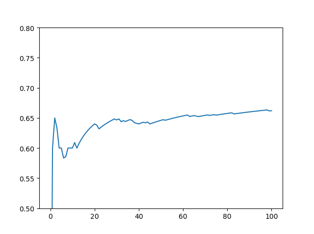

**贝塔伯努利分布的汤普森采样算法**

**1.伪代码**

```pseudocode
for t = 1,2,... do 
	for k = 1,2,...,K do
		theta[k] = random.beta(alpha[k],beta[k])
	end for
	max_arm = argmax(theta)
	alpha[max_arm] = alpha[max_arm] + r
	beta[max_arm] = beta[max_arm] + 1 - r
end for
```

**2.代码**

```python
import numpy as np
import random
import matplotlib.pyplot as plt
import math

# reward:假设每一个arm的reward分布服从伯努利分布
R = np.array([0.5, 0.7, 0.6])
K = 3
T = 100
alpha = np.ones(K)
beta = np.ones(K)
theta = np.zeros(K)
sum_reward = np.zeros(T+1)
mean_reward = np.zeros(T+1)
for t in range(T):
    for k in range(K):
        theta[k] = random.betavariate(alpha[k], beta[k])
    max_theta = theta[0]
    max_arm = 0
    for k in range(K):
        if theta[k] > max_theta:
            max_theta = theta[k]
            max_arm = k
    alpha[max_arm] = alpha[max_arm] + R[max_arm]
    beta[max_arm] = beta[max_arm] + 1 - R[max_arm]
    sum_reward[t+1] = sum_reward[t] + R[max_arm]
    mean_reward[t+1] = sum_reward[t+1] / (t+1)
x = np.arange(T + 1)
y = mean_reward
plt.plot(x, y, label='TS')
plt.ylim(0.5, 0.8)
plt.show()
```

**3.输出**

