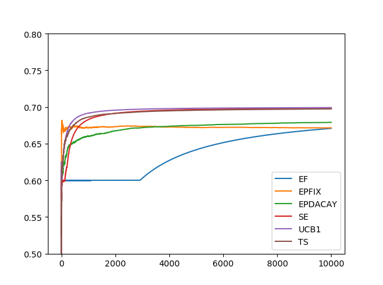

```python
import numpy as np
import matplotlib.pyplot as plt
import math
import random


# reward:假设一个arm的reward分布服从伯努利分布
R = np.array([0.5, 0.7, 0.6])

K = 3  # arm数量K
T = 10000  # 总轮次T
# 探索过程的每个arm被选择次数N
N = int(math.pow(T, 2/3)*math.pow(math.log(T), 1/3))


def argmax(Q, K):
    amax = 0
    for i in range(K):
        if Q[amax] < Q[i]:
            amax = i
    return amax


def exploreFirst():
    sum_reward = np.zeros(T + 1)  # 总奖赏
    mean_reward = np.zeros(T + 1)  # 平均奖赏
    Q = np.zeros(K)  # 每个arm的平均奖赏
    # 探索过程
    for t in range(K * N):
        sum_reward[t + 1] = sum_reward[t] + R[t % K]
        mean_reward[t + 1] = sum_reward[t + 1] / (t + 1)
    # 每个arm的平均奖赏
    for k in range(K):
        Q[k] = (R[k] * N) / (K * N)
    # 选出最大arm的序号
    amax = argmax(Q, K)

    for t in range(K * N, T):
        sum_reward[t + 1] = sum_reward[t] + R[amax]
        mean_reward[t + 1] = sum_reward[t + 1] / (t + 1)
    x = np.arange(T + 1)
    y = mean_reward
    plt.plot(x, y,label='EF')


def epsilonFixedGreedy():
    sum_reward = np.zeros(T + 1)  # 总奖赏
    mean_reward = np.zeros(T + 1)  # 平均奖赏
    Q = np.zeros(K)  # 每个arm的平均奖赏
    count = np.zeros(K)  # 每个arm被选则的次数
    e = K * N / T  # 固定的epsilon
    for t in range(T):
        if np.random.rand() < e:
            k = np.random.randint(0, K)
        else:
            k = argmax(Q, K)
        sum_reward[t + 1] = sum_reward[t] + R[k]
        mean_reward[t + 1] = sum_reward[t + 1] / (t + 1)
        Q[k] = (Q[k] * count[k] + R[k]) / (count[k] + 1)
        count[k] = count[k] + 1
    x = np.arange(T + 1)
    y = mean_reward
    plt.plot(x, y,label='EPFIX')


def epsilonDacayGreedy():
    sum_reward = np.zeros(T + 1)  # 总奖赏
    mean_reward = np.zeros(T + 1)  # 平均奖赏
    Q = np.zeros(K)  # 每个arm的平均奖赏
    count = np.zeros(K)  # 每个arm被选则的次数
    for t in range(T):
        # 衰减的epsilon
        e = math.pow(t + 1, -1 / 3) * math.pow(K * math.log(t + 1), 1 / 3)
        if np.random.rand() < e:
            k = np.random.randint(0, K)
        else:
            k = argmax(Q, K)
        sum_reward[t + 1] = sum_reward[t] + R[k]
        mean_reward[t + 1] = sum_reward[t + 1] / (t + 1)
        Q[k] = (Q[k] * count[k] + R[k]) / (count[k] + 1)
        count[k] = count[k] + 1
    x = np.arange(T + 1)
    y = mean_reward
    plt.plot(x, y,label='EPDACAY')


def successiveElimination():
    sum_reward = np.zeros(T + 1)  # 总奖赏
    mean_reward = np.zeros(T + 1)  # 平均奖赏
    Q = np.zeros(K)  # 每个arm的平均奖赏
    count = np.zeros(K)  # 每个arm被选则的次数
    r = np.zeros(K)  # 置信半径
    a = np.zeros(K)  # 是否淘汰标记,1表示淘汰
    UCB = np.zeros(K)  # 上界
    LCB = np.zeros(K)  # 下界
    index = 0  # 计算arm序号的辅助量
    t = 0  # 第t轮
    amax = 0  # 最优arm

    while t < T:

        # 轮流选择 arm
        if a[index % K] == 0:
            k = index % K
            index = index + 1
        else:
            index = index + 1
            continue

        sum_reward[t + 1] = sum_reward[t] + R[k]  # 累积奖赏
        mean_reward[t + 1] = sum_reward[t + 1] / (t + 1)  # 平均累积奖赏
        r[k] = math.sqrt((2 * math.log(T))) / (count[k] + 1)  # 序号k的arm的置信半径
        Q[k] = (Q[k] * count[k] + R[k]) / (count[k] + 1)  # 序号k的arm的平均累积奖赏
        UCB[k] = Q[k] + r[k]  # 上界公式
        LCB[k] = Q[k] - r[k]  # 下界公式
        count[k] = count[k] + 1  # 序号为k的arm的被选择次数
        t = t + 1

        # 淘汰非最优arm
        for i in range(K):
            if (UCB[i] < LCB[k]) & (a[i] != 1):
                a[i] = 1

        # 判断是否只剩一个最优arm
        cnt = 0
        for i in range(K):
            if a[i] == 1:
                cnt = cnt + 1
        if cnt == K - 1:
            amax = k
            break

    # 第二阶段，利用
    while t < T:
        sum_reward[t + 1] = sum_reward[t] + R[amax]
        mean_reward[t + 1] = sum_reward[t + 1] / (t + 1)
        t = t + 1

    x = np.arange(T + 1)
    y = mean_reward
    plt.plot(x, y,label='SE')


def UCB1():
    sum_reward = np.zeros(T + 1)  # 总奖赏
    mean_reward = np.zeros(T + 1)  # 平均奖赏
    Q = np.zeros(K)  # 每个arm的平均奖赏
    count = np.zeros(K)  # 每个arm被选则的次数
    r = np.zeros(K)  # 置信半径
    a = np.zeros(K)  # 是否淘汰标记,1表示淘汰
    UCB = np.zeros(K)  # 上界
    LCB = np.zeros(K)  # 下界
    index = 0  # 计算arm序号的辅助量
    t = 0  # 第t轮

    while t < K:
        sum_reward[t + 1] = sum_reward[t] + R[t]  # 累积奖赏
        mean_reward[t + 1] = sum_reward[t + 1] / (t + 1)  # 平均累积奖赏
        r[t] = math.sqrt((2 * math.log(T))) / (count[t] + 1)  # 序号k的arm的置信半径
        Q[t] = (Q[t] * count[t] + R[t]) / (count[t] + 1)  # 序号k的arm的平均累积奖赏
        UCB[t] = Q[t] + r[t]  # 上界公式
        count[t] = count[t] + 1  # 序号为k的arm的被选择次数
        t = t + 1
    while t < T:
        k = 0
        for i in range(K):
            if UCB[k] < UCB[i]:
                k = i
        sum_reward[t + 1] = sum_reward[t] + R[k]  # 累积奖赏
        mean_reward[t + 1] = sum_reward[t + 1] / (t + 1)  # 平均累积奖赏
        r[k] = math.sqrt((2 * math.log(T))) / (count[k] + 1)  # 序号k的arm的置信半径
        Q[k] = (Q[k] * count[k] + R[k]) / (count[k] + 1)  # 序号k的arm的平均累积奖赏
        UCB[k] = Q[k] + r[k]  # 上界公式
        LCB[k] = Q[k] - r[k]  # 下界公式
        count[k] = count[k] + 1  # 序号为k的arm的被选择次数
        t = t + 1
    x = np.arange(T + 1)
    y = mean_reward
    plt.plot(x, y,label='UCB1')


def TS():
    alpha = np.ones(K)
    beta = np.ones(K)
    theta = np.zeros(K)
    sum_reward = np.zeros(T+1)
    mean_reward = np.zeros(T+1)
    for t in range(T):
        for k in range(K):
            theta[k] = random.betavariate(alpha[k], beta[k])
        max_theta = theta[0]
        max_arm = 0
        for k in range(K):
            if theta[k] > max_theta:
                max_theta = theta[k]
                max_arm = k
        alpha[max_arm] = alpha[max_arm] + R[max_arm]
        beta[max_arm] = beta[max_arm] + 1 - R[max_arm]
        sum_reward[t+1] = sum_reward[t] + R[max_arm]
        mean_reward[t+1] = sum_reward[t+1] / (t+1)
    x = np.arange(T + 1)
    y = mean_reward
    plt.plot(x, y, label='TS')


if __name__ == '__main__':
    fig = plt.figure()
    exploreFirst()
    epsilonFixedGreedy()
    epsilonDacayGreedy()
    successiveElimination()
    UCB1()
    TS()
    plt.ylim(0.5, 0.8)
    plt.legend()
    plt.show()
```

**输出**

