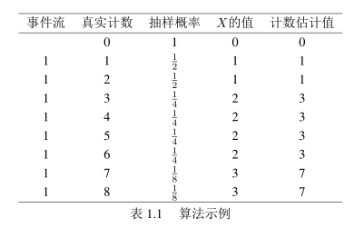

**尾概率不等式**

+ 尾概率不等式：尾概率的上界，包括马尔可夫不等式，切比雪夫不等式，切诺夫不等式。

+ 符号说明
  + 样本空间为$\Omega$
  + 随机变量为$X$
  + 正实数$a, r$
  + $X$的期望为$E(X)$
  + $X$的方差为$D(X)$

**1.马尔可夫不等式**
$$
P(X\geq a)\leq\ \frac{E(X)}{a}
$$
**2.切比雪夫不等式**
$$
P(|X-E(X)|\geq r)\leq \frac{D(X)}{r^{2}}
$$
**3.切诺夫不等式**

+ 符号说明

  + 样本空间为$\Omega$。
  + 第$i$个样本对应的随机变量为$X_i$，且相互独立。
  + 样本空间大小为$n$。
  + 随机变量$X=\sum\limits_{i=1}^{n}X_i$。
  + 参数$\mu=\sum\limits_{i=1}^{n}p_i$
  + 参数$\delta\in (0,1)$
  + 约束$P(X_i=1)=p_i$

+ 公式
  $$
  (1)P(X<(1-\delta)\mu)<\exp(-\frac{\mu\delta^{2}}{2})\\
  (2)P(X>(1+\delta)\mu)<\exp(-\frac{\mu\delta^{2}}{4})
  $$

**4.例题**

抛一枚硬币500次，计算有300次正面朝上的概率。
$$
设抛500次中正面朝上的次数为X\\
E(X)=np=500\times \frac{1}{2}=250\\
D(X)=np(1-p)<500\times \frac{1}{2} \times \frac{1}{2}=125\\
(1)马尔可夫不等式：\\
P(x>300)=\frac{E(X)}{300}=\frac{5}{6}\\
(2)切比雪夫不等式：\\
P(X>300)=P(X-250>50)<P(|X-250|>50)<\frac{D(X)}{50^2}=\frac{1}{100}\\
(3)切诺夫不等式：\\
\mu=\sum\limits_{i=1}^{500}p=500\times\frac{1}{2}=250\\
P(X>300)=P(X>\frac{300}{250}\times 250)=P(X>(1+\frac{1}{5})\times250)\\<\exp(-\frac{250\times (\frac{1}{5})^{2}}{4})=\exp(\frac{5}{2})
$$
**5.Morris算法**

+ 计数估计的方差为$O(N^2)$

```pseudocode
输入:事件信号X

输出:事件计数C

1.初始化X = 0;
2.while 事件发生 do
	以1 / 2 ^ X的概率更新X = X + 1;
3.C = 2 ^ X - 1;
```



**6.Morris+算法**

+ 计数估计的方差为$O(\frac{N^2}{n})$
+ 根据切比雪夫不等式$P(|\hat{N}-N|>\epsilon N)<\frac{\operatorname{D}(\hat{N})}{\epsilon^{2} N^{2}}$，其中$\hat{N}$是计数估计，$N$是真实计数，$\epsilon>0$

```pseudocode
输入:事件信号X

输出:事件计数C

1.初始化X[1...n]=0;
2.while 事件发生 do
	for i = 1 to n do
		以1 / 2 ^ X的概率更新X[i] = X[i] + 1
3.for i=1 to n do
	C = C + 2 ^ X[i] - 1;
4.C = C / n;
```

**7.Morris++算法**

```pseudocode
输入:事件信号X

输出:事件计数C

1.初始化X[1...n][1...m] = 0;
2.初始化C[1...m] = 0;
3.while 事件发生 do
	for i = 1 to n do
		for j = 1 to m do
			以1 / 2 ^ X[i][j]的概率更新X[i][j] = X[i][j] + 1
4.for i = 1 to n do
	C[j] = C[j] + 2 ^ X[i][j] - 1;
5.C = C的中位数;
```

