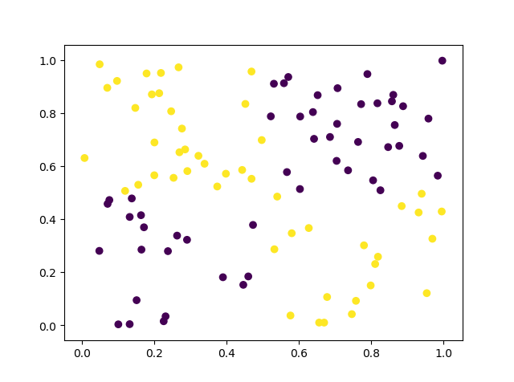

#### 高斯朴素贝叶斯分类

+ code

```
import numpy as np
import matplotlib.pyplot as plt
from sklearn.metrics import mean_squared_error
from sklearn import naive_bayes

X = np.random.rand(200, 2)
X_train = X[0:100,:]
X_test = X[100:200,:]
y=np.empty(200)
for i in range(200):
    if X[i, 0] > 0.5 and X[i, 1] > 0.5:
        y[i] = 0
    elif X[i, 0] < 0.5 and X[i, 1] < 0.5:
        y[i] = 0
    else:
        y[i] = 1    
y_train = y[0:100]
y_test = y[100:200]

gnb = naive_bayes.GaussianNB()
gnb.fit(X_train, y_train)
y_pred = gnb.predict(X_test)
print("MSE= %.1f" % mean_squared_error(y_test, y_pred))

plt.scatter(X_test[:, 0], X_test[:, 1],c=y_test)
plt.show()
```

+ output

```
MSE= 0.5
```

