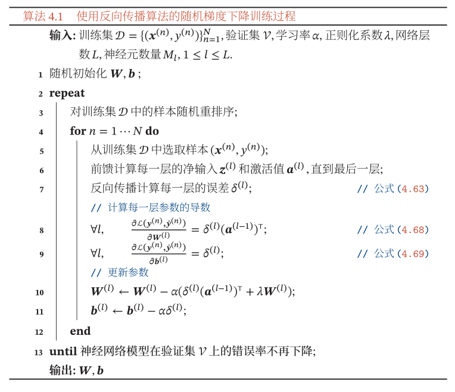

##### 公式4.1-4.2

$$
\begin{aligned}
z &=\sum_{i=1}^{d} w_{i} x_{i}+b \\
&=\boldsymbol{w}^{\mathrm{T}} \boldsymbol{x}+b
\end{aligned}
$$

**实例4.1-4.2**

```python
import numpy as np

z = 0  # 净输入
w = np.asarray([1, 2, 3])  # 3维权重向量
x = np.asarray([1, 2, 3])  # 输入向量
b = 1  # 偏置

z = np.vdot(w, x) + b  # 公式4.1，4.2

print(z)

'''
15
'''
```

##### 公式4.3

$$
a=f(z)
$$
**实例4.3**

```python
import numpy as np


def f(x):  # 非线性函数f，假设为正弦函数
    return np.sin(x)


a = 0  # 活性值
z = 15  # 净输入

a = f(15)  # 公式4.3

print(a)

'''
0.6502878401571168
'''
```

##### 公式4.4

$$
\sigma(x)=\frac{1}{1+\exp (-x)}
$$

**实例4.4**

```python
import numpy as np
import math


def sigma(x):  # Logistic函数
    return 1 / (1 + math.exp(-x))


sigma_x = 0  # 输出
x = 1  # 输入

sigma_x = sigma(x)  # 公式4.4

print(sigma_x)

'''
0.7310585786300049
'''
```

##### 公式4.5

$$
\tanh (x)=\frac{\exp (x)-\exp (-x)}{\exp (x)+\exp (-x)}
$$

**实例4.5**

```python
import numpy as np
import math


def tanh(x):  # Tanh函数
    return (math.exp(x) - math.exp(-x)) / (math.exp(x) + math.exp(-x))


tanh_x = 0  # 输出
x = 1  # 输入

tanh_x = tanh(x)  # 公式4.5

print(tanh_x)

'''
0.7615941559557649
'''
```

##### 公式4.6

$$
\tanh (x)=2 \sigma(2 x)-1
$$

**实例4.6**

```python
import numpy as np
import math


def sigma(x):  # Logistic函数
    return 1 / (1 + math.exp(-x))


def tanh(x):  # Tanh函数
    return 2 * sigma(2 * x) - 1


tanh_x = 0  # 输出
x = 1  # 输入

tanh_x = tanh(x)  # 公式4.6

print(tanh_x)

'''
0.7615941559557646
'''
```

##### 公式4.7-4.8

$$
\begin{aligned}
g_{l}(x) & \approx \sigma(0)+x \times \sigma^{\prime}(0) \\
&=0.25 x+0.5
\end{aligned}
$$

**实例4.7-4.9**

```python
import numpy as np
import math


def sigma(x):  # Logistic函数
    return 1 / (1 + math.exp(-x))


def sigma_fd(x):  # Logistic函数的一阶导函数
    return sigma(x)*(1-sigma(x))


def g_l(x):  # Logistic函数的一阶泰勒展开函数
    return sigma(0) + x * sigma_fd(0)


g_l_x = 0  # 输出
x = 1  # 输入

g_l_x = g_l(x)  # 公式4.7-4.8

print(g_l_x)

'''
0.75
'''
```

##### 公式4.9-4.11

$$
\begin{aligned}
\text { hard-logistic }(x) &=\left\{\begin{array}{ll}
1 & g_{l}(x) \geq 1 \\
g_{l} & 0<g_{l}(x)<1 \\
0 & g_{l}(x) \leq 0
\end{array}\right.\\
&=\max \left(\min \left(g_{l}(x), 1\right), 0\right) \\
&=\max (\min (0.25 x+0.5,1), 0)
\end{aligned}
$$

**实例4.9-4.11**

```python
import numpy as np
import math


def sigma(x):  # Logistic函数
    return 1 / (1 + math.exp(-x))


def sigma_fd(x):  # Logistic函数的一阶导函数
    return sigma(x)*(1-sigma(x))


def g_l(x):  # Logistic函数的一阶泰勒展开函数
    return sigma(0) + x * sigma_fd(0)


def hard_logistic(x):  # 分段函数hard_logistic近似logistic函数
    if g_l(x) >= 1:
        return 1
    elif g_l(x) <= 0:
        return 0
    else:
        return g_l(x)


hard_logistic_x = 0  # 输出
x = 1  # 输入

hard_logistic_x = hard_logistic(x)  # 公式4.9-4.11

print(hard_logistic_x)

'''
0.75
'''
```

##### 公式4.12-4.13

$$
\begin{aligned}
g_{t}(x) & \approx \tanh (0)+x \times \tanh ^{\prime}(0) \\
&=x
\end{aligned}
$$

**实例4.12-4.13**

```python
import numpy as np
import math


def tanh(x):  # Tanh函数
    return (math.exp(x) - math.exp(-x)) / (math.exp(x) + math.exp(-x))


def tanh_fd(x):  # Tanh函数的一阶导函数
    return 1 - tanh(x) ** 2


def g_t(x):  # Tanh函数在0附近的一阶泰勒展开函数
    return tanh(0) + x * tanh_fd(0)


g_t_x = 0  # 输出
x = 1  # 输入

g_t_x = g_t(x)  # 公式4.12-4.13

print(g_t_x)

'''
1.0
'''
```

##### 公式4.14-4.15

$$
\begin{aligned}
\text { hard-tanh }(x) 
&=\left\{\begin{array}{ll}
1 & g_{t}(x) \geq 1 \\
g_{t} & 0<g_{t}(x)<1 \\
-1 & g_{t}(x) \leq -1
\end{array}\right.\\
&=\max \left(\min \left(g_{t}(x), 1\right),-1\right) \\
&=\max (\min (x, 1),-1)
\end{aligned}
$$

**实例4.14-4.15**

```python
import numpy as np
import math


def tanh(x):  # Tanh函数
    return (math.exp(x) - math.exp(-x)) / (math.exp(x) + math.exp(-x))


def tanh_fd(x):  # Tanh函数的一阶导函数
    return 1 - tanh(x) ** 2


def g_t(x):  # Tanh函数在0附近的一阶泰勒展开函数
    return tanh(0) + x * tanh_fd(0)


def hard_tanh(x):  # 分段函数hard_tanh近似tanh函数
    if g_t(x) >= 1:
        return 1
    elif g_t(x) <= -1:
        return - 1
    else:
        return g_t(x)


hard_tanh_x = 0  # 输出
x = 1  # 输入

hard_tanh_x = hard_tanh(x)  # 公式4.14-4.15

print(hard_tanh_x)

'''
1
'''
```

##### 公式4.16-4.17

$$
\begin{aligned}
\operatorname{ReLU}(x) &=\left\{\begin{array}{ll}
x & x \geq 0 \\
0 & x<0
\end{array}\right.\\
&=\max (0, x)
\end{aligned}
$$

**实例4.16-4.17**

```python
import numpy as np
import math


def relu(x):  # ReLU函数,修正线性单元函数
    if x >= 0:
        return x
    else:
        return 0


relu_x = 0  # 输出
x = 1  # 输入

relu_x = relu(x)  # 公式4.16-4.17

print(relu_x)

'''
1
'''
```

##### 公式4.18-4.19

$$
\begin{aligned}
\text { LeakyReLU }(x) &=\left\{\begin{array}{ll}
x & \text { if } x>0 \\
\gamma x & \text { if } x \leq 0
\end{array}\right.\\
&=\max (0, x)+\gamma \min (0, x)
\end{aligned}
$$

**实例4.18-4.19**

```python
import numpy as np
import math


def leaky_relu(x):  # 带泄露的Relu函数
    gamma = 0.001
    if x > 0:
        return x
    else:
        return gamma * x


leaky_relu_x = 0  # 输出
x = 1  # 输入

leaky_relu_x = leaky_relu(x)  # 公式4.18-4.19

print(leaky_relu_x)

'''
1
'''
```

##### 公式4.20

$$
\text { LeakyReLU }(x)=\max (x, \gamma x)
$$

**实例4.20**

```python
import numpy as np
import math


def leaky_relu(x):  # 带泄露的Relu函数
    gamma = 0.001
    return max(x, gamma * x)

leaky_relu_x = 0  # 输出
x = 1  # 输入

leaky_relu_x = leaky_relu(x)  # 公式4.20

print(leaky_relu_x)

'''
1
'''
```

##### 公式4.21-4.22

$$
\begin{aligned}
\operatorname{PReLU}_{i}(x) &=\left\{\begin{array}{ll}
x & \text { if } x>0 \\
\gamma_{i} x & \text { if } x \leq 0
\end{array}\right.\\
&=\max (0, x)+\gamma_{i} \min (0, x)
\end{aligned}
$$

**实例4.21-4.22**

```python
import numpy as np
import math

gamma = [0.001, 0.002, 0.003]


def p_relu(i, x):  # 带参数的Relu函数
    if x > 0:
        return x
    else:
        return gamma[i] * x


p_relu_i_x = 0  # 输出
x = 1  # 输入
i = 1  # 神经元的序号


p_relu_i_x = p_relu(i, x)  # 公式4.21-4.22

print(p_relu_i_x)

'''
1
'''
```

##### 公式4.23-4.24

$$
\begin{aligned}
\operatorname{ELU}(x) &=\left\{\begin{array}{ll}
x & \text { if } x>0 \\
\gamma(\exp (x)-1) & \text { if } x \leq 0
\end{array}\right.\\
&=\max (0, x)+\min (0, \gamma(\exp (x)-1))
\end{aligned}
$$

**实例4.23-4.24**

```python
import numpy as np
import math


def elu(x):  # ELU函数，指数线性单元函数
    gamma = 0.001
    if x > 0:
        return x
    else:
        return gamma*(math.exp(x)-1)


elu_x = 0  # 输出
x = 1  # 输入

elu_x = elu(x)  # 公式4.23-4.24

print(elu_x)

'''
1
'''
```

##### 公式4.25

$$
\text { Softplus }(x)=\log (1+\exp (x))
$$

**实例4.25**

```python
import numpy as np
import math


def softplus(x):  # Softplus函数
    return math.log(1 + math.exp(x))


softplus_x = 0  # 输出
x = 1  # 输入

softplus_x = softplus(x)  # 公式4.25

print(softplus_x)

'''
1.3132616875182228
'''
```

##### 公式4.26

$$
\operatorname{swish}(x)=x \sigma(\beta x)
$$

**实例4.26**

```python
import numpy as np
import math


def sigma(x):  # Logistic函数
    return 1 / (1 + math.exp(-x))


def swish(x):  # swish函数
    # beta = 0  #线性函数
    beta = 1  # x>0线性，x<0近似饱和
    # beta = 100  #近似relu函数
    return x * sigma(beta * x)


swish_x = 0  # 输出
x = 1  # 输入

swish_x = swish(x)  # 公式4.26

print(swish_x)
'''
0.7310585786300049
'''
```

##### 公式4.27

$$
\operatorname{GELU}(x)=x P(X \leq x)
$$

**实例4.27**

```python
import numpy as np
import math
from scipy.stats import norm


def P(x):  # 高斯分布N(mu,sigma^2)的累积分布函数
    return norm.cdf(x, 0, 1)


def gelu(x):  # GELU函数，高斯误差线性单元
    return x * P(x)


gelu_x = 0  # 输出
x = 1  # 输入

gelu_x = gelu(x)  # 公式4.27

print(gelu_x)

'''
0.8413447460685429
'''
```

##### 公式4.28

$$
\operatorname{GELU}(x) \approx 0.5 x\left(1+\tanh \left(\sqrt{\frac{2}{\pi}}\left(x+0.044715 x^{3}\right)\right)\right)
$$

**实例4.28**

```python
import numpy as np
import math


def tanh(x):  # Tanh函数
    return (math.exp(x) - math.exp(-x)) / (math.exp(x) + math.exp(-x))


def gelu(x):  # 近似GELU函数
    return 0.5 * x * (1 + tanh(math.sqrt(2 / math.pi) * (x + 0.044715 * x ** 3)))


gelu_x = 0  # 输出
x = 1  # 输入

gelu_x = gelu(x)  # 公式4.28

print(gelu_x)
'''
0.8411919906082768
'''
```

##### 公式4.29

$$
\operatorname{GELU}(x) \approx x \sigma(1.702 x)
$$

**实例4.29**

```python
import numpy as np
import math


def sigma(x):  # Logistic函数
    return 1 / (1 + math.exp(-x))


def gelu(x):  # 近似GELU函数
    return x * sigma(1.702 * x)


gelu_x = 0
x = 1

gelu_x = gelu(x)

print(gelu_x)
'''
0.8457957659328212
'''
```

##### 公式4.30

$$
z_{k}=\boldsymbol{w}_{k}^{\mathrm{T}} \boldsymbol{x}+b_{k}
$$

**实例4.30**

```python
import numpy as np
import math

K = 3  # 权重向量的个数
z = np.zeros(K)  # K个净输入组成的向量
w = np.asarray([[1, 2, 3], [1, 2, 3], [1, 2, 3]])  # K个权重向量组成的矩阵
x = np.asarray([1, 2, 3])  # 输入向量
b = np.asarray([1, 2, 3])  # K个偏置组成的向量

for k in range(K):
    z[k] = np.vdot(w[k], x) + b[k]  # 公式4.30

print(z)

'''
[15. 16. 17.]
'''
```

##### 公式4.31

$$
\operatorname{maxout}(\boldsymbol{x})=\max _{k \in[1, K]}\left(z_{k}\right)
$$

**实例4.31**

```python
import numpy as np
import math

K = 3  # 权重向量的个数
z = np.zeros(K)  # K个净输入组成的向量
w = np.asarray([[1, 2, 3], [1, 2, 3], [1, 2, 3]])  # K个权重向量组成的矩阵
x = np.asarray([1, 2, 3])  # 输入向量
b = np.asarray([1, 2, 3])  # K个偏置组成的向量

for k in range(K):
    z[k] = np.vdot(w[k], x) + b[k]  # 公式4.30


def maxout(x):  # maxout函数
    return max(x)


maxout_x = 0  # 输出
x = 1  # 输入

maxout_x = maxout(z)  # 公式4.31

print(maxout_x)
'''
17.0
'''
```

##### 公式4.32

$$
z^{(l)}=W^{(l)} \boldsymbol{a}^{(l-1)}+\boldsymbol{b}^{(l)}
$$

**实例4.32**

```python
import numpy as np

# 第0层神经元个数(特征向量的维数)
M_0 = 3
# 第1层神经元个
M_1 = 4

# 第0层到第1层的权重矩阵
W_1 = np.ones((M_1, M_0), dtype=float)
# 第0层神经元的输出(即x)
a_0 = np.array([[1, 2, 3]]).T
# 第0层到第1层的偏置
b_1 = np.ones((M_1, 1))
# 第1层神经元的净输入
z_1 = np.dot(W_1, a_0) + b_1
print(z_1)
'''
[[7.]
 [7.]
 [7.]
 [7.]]
'''
```

##### 公式4.33

$$
\boldsymbol{a}^{(l)}=f_{l}\left(z^{(l)}\right)
$$

**实例4.33**

```python
import numpy as np


def f_1(x):
    '''
    第1层神经元的激活函数
    '''
    return 1 / (1 + np.exp(-x))


# 第0层神经元个数
M_0 = 3
# 第1层神经元个数
M_1 = 4

# 第0层到第1层的权重矩阵
W_1 = np.ones((M_1, M_0), dtype=float)
# 第0层神经元的输出(即x)
a_0 = np.array([[1, 2, 3]]).T
# 第0层到第1层的偏置
b_1 = np.ones((M_1, 1))
# 第1层神经元的净输入
z_1 = np.dot(W_1, a_0) + b_1
# 第1层神经元的输出
a_1 = f_1(z_1)
print(a_1)
'''
[[0.99908895]
 [0.99908895]
 [0.99908895]
 [0.99908895]]
'''
```

##### 公式4.35

$$
\boldsymbol{a}^{(l)}=f_{l}\left(\boldsymbol{W}^{(l)} \boldsymbol{a}^{(l-1)}+\boldsymbol{b}^{(l)}\right)
$$

**实例4.35**

```python
import numpy as np


def f_1(x):
    '''
    第1层神经元的激活函数
    '''
    return 1 / (1 + np.exp(-x))


# 第0层神经元个数
M_0 = 3
# 第1层神经元个数
M_1 = 4

# 第0层到第1层的权重矩阵
W_1 = np.ones((M_1, M_0), dtype=float)
# 第0层神经元的输出(即x)
a_0 = np.array([[1, 2, 3]]).T
# 第0层到第1层的偏置
b_1 = np.ones((M_1, 1))
# 第1层神经元的输出
a_1 = f_1(np.dot(W_1, a_0) + b_1)
print(a_1)
'''
[[0.99908895]
 [0.99908895]
 [0.99908895]
 [0.99908895]]
'''
```

##### 公式4.36

$$
\boldsymbol{x}=\boldsymbol{a}^{(0)} \rightarrow \boldsymbol{z}^{(1)} \rightarrow \boldsymbol{a}^{(1)} \rightarrow \boldsymbol{z}^{(2)} \rightarrow \cdots \rightarrow \boldsymbol{a}^{(L-1)} \rightarrow \boldsymbol{z}^{(L)} \rightarrow \boldsymbol{a}^{(L)}=\phi(\boldsymbol{x} ; \boldsymbol{W}, \boldsymbol{b})
$$

**实例4.36**

```python
import numpy as np


def f(x):
    '''
    神经元的激活函数
    '''
    return 1 / (1 + np.exp(-x))


# 第0层神经元个数
M_0 = 3
# 第1层神经元个数
M_1 = 4
# 第2层神经元个数
M_2 = 1

# 第0层神经元的输出(即x)
a_0 = np.array([[1, 2, 3]]).T

# 第0层到第1层的权重矩阵
W_1 = np.ones((M_1, M_0), dtype=float)
# 第0层到第1层的偏置
b_1 = np.ones((M_1, 1))
# 第1层神经元的输出
a_1 = f(np.dot(W_1, a_0) + b_1)

# 第1层到第2层的权重矩阵
W_2 = np.ones((M_2, M_1), dtype=float)
# 第1层到第2层的偏置
b_2 = np.ones((M_2, 1))
# 第2层神经元的输出(即y)
a_2 = f(np.dot(W_2, a_1) + b_2)

print(a_2)
'''
[[0.99328288]]
'''
```

##### 公式4.40

$$
p(y=1 \mid \boldsymbol{x})=a^{(L)}
$$

**实例4.40**

```python
import numpy as np


def f(x):
    '''
    神经元的激活函数sigma(x)
    '''
    return 1 / (1 + np.exp(-x))


# 第0层神经元个数
M_0 = 3
# 第1层神经元个数
M_1 = 4
# 第2层神经元个数
M_2 = 1

# 第0层神经元的输出(即x)
a_0 = np.array([[1, 2, 3]]).T

# 第0层到第1层的权重矩阵
W_1 = np.ones((M_1, M_0), dtype=float)
# 第0层到第1层的偏置
b_1 = np.ones((M_1, 1))
# 第1层神经元的输出
a_1 = f(np.dot(W_1, a_0) + b_1)

# 第1层到第2层的权重矩阵
W_2 = np.ones((M_2, M_1), dtype=float)
# 第1层到第2层的偏置
b_2 = np.ones((M_2, 1))
# 第2层神经元的输出(即y)
a_2 = f(np.dot(W_2, a_1) + b_2)
# 类别y=1的条件概率
p = a_2
print(p)

'''
[[0.99328288]]
'''
```

##### 公式4.41

$$
\hat{\boldsymbol{y}}=\operatorname{softmax}\left(z^{(L)}\right)
$$

**实例4.41**

```python
import numpy as np


def f(x):
    '''
    激活函数sigma(x)
    '''
    return 1 / (1 + np.exp(-x))


def softmax(x):
    '''
    激活函数softmax(x)
    '''
    return np.exp(x) / (np.vdot(np.ones(C), np.exp(x)))


# 类别数量
C = 10
# 第0层神经元个数
M_0 = 3
# 第1层神经元个数
M_1 = 4
# 第2层神经元个数
M_2 = C

# 第0层神经元的输出(即x)
a_0 = np.array([[1, 2, 3]]).T

# 第0层到第1层的权重矩阵
W_1 = np.random.rand(M_1, M_0)
# 第0层到第1层的偏置
b_1 = np.ones((M_1, 1))
# 第1层神经元的输出
a_1 = f(np.dot(W_1, a_0) + b_1)

# 第1层到第2层的权重矩阵
W_2 = np.random.rand(M_2, M_1)
# 第1层到第2层的偏置
b_2 = np.ones((M_2, 1))
# 第2层神经元的输出(即y)
a_2 = softmax(np.dot(W_2, a_1) + b_2)
# 每个类的条件概率
y_predict_v = a_2

print(y_predict_v)
'''
[[0.04621109]
 [0.12578412]
 [0.19063479]
 [0.02744378]
 [0.0937828 ]
 [0.03752134]
 [0.08774394]
 [0.17376121]
 [0.09420282]
 [0.12291411]]
'''
```

##### 公式4.42

$$
\mathcal{L}(\boldsymbol{y}, \hat{\boldsymbol{y}})=-\boldsymbol{y}^{\top} \log \hat{\boldsymbol{y}}
$$

**实例4.42**

```python
import numpy as np


def f(x):
    '''
    激活函数sigma(x)
    '''
    return 1 / (1 + np.exp(-x))


def softmax(x):
    '''
    激活函数softmax(x)
    '''
    return np.exp(x) / (np.vdot(np.ones(C), np.exp(x)))


# 类别数量
C = 10
# 第0层神经元个数
M_0 = 3
# 第1层神经元个数
M_1 = 4
# 第2层神经元个数
M_2 = C

# 第0层神经元的输出(即x)
a_0 = np.array([[1, 2, 3]]).T

# 第0层到第1层的权重矩阵
W_1 = np.random.rand(M_1, M_0)
# 第0层到第1层的偏置
b_1 = np.ones((M_1, 1))
# 第1层神经元的输出
a_1 = f(np.dot(W_1, a_0) + b_1)

# 第1层到第2层的权重矩阵
W_2 = np.random.rand(M_2, M_1)
# 第1层到第2层的偏置
b_2 = np.ones((M_2, 1))
# 第2层神经元的输出(即y)
a_2 = softmax(np.dot(W_2, a_1) + b_2)

# 每个类的条件概率
y_predict_v = a_2

# 样本x对应的类别标签
y = 2
# one-hot向量
y_v = np.zeros(C)
y_v[y] = 1

# 交叉熵损失
loss = -np.vdot(y_v, np.log(y_predict_v))
print(loss)
'''
2.975613690962053
'''
```

##### 公式4.43

$$
\mathcal{R}(\boldsymbol{W}, \boldsymbol{b})=\frac{1}{N} \sum_{n=1}^{N} \mathcal{L}\left(\boldsymbol{y}^{(n)}, \hat{\boldsymbol{y}}^{(n)}\right)+\frac{1}{2} \lambda\|\boldsymbol{W}\|_{F}^{2}
$$

**实例4.43**

```python
import numpy as np


def f(x):
    '''
    激活函数sigma(x)
    '''
    return 1 / (1 + np.exp(-x))


def softmax(x):
    '''
    激活函数softmax(x)
    '''
    return np.exp(x) / (np.vdot(np.ones(C), np.exp(x)))


# 类别数量
C = 10
# 样本维数
D = 3
# 训练集样本数量
N = 4

# 第0层神经元个数(特征向量的维数)
M_0 = D
# 第1层神经元个数
M_1 = 4
# 第2层神经元个数(类别数量)
M_2 = C

# 训练集特征矩阵
x_train = np.random.rand(N, D)

# 训练集标签
y_train = np.array([3, 0, 5, 1])
# one-hot向量
y_train_v = np.zeros((N, C))
for n in range(N):
    y_train_v[n, y_train[n]] = 1


# 第0层到第1层的权重矩阵
W_1 = np.random.rand(M_1, M_0)
# 第0层到第1层的偏置
b_1 = np.ones((M_1, 1))

# 第1层到第2层的权重矩阵
W_2 = np.random.rand(M_2, M_1)
# 第1层到第2层的偏置
b_2 = np.ones((M_2, 1))

sum = 0
for n in range(N):
    # 第0层神经元的输出(即x)
    a_0 = x_train[n, np.newaxis].T

    # 第1层神经元的输出
    a_1 = f(np.dot(W_1, a_0) + b_1)

    # 第2层神经元的输出(即y)
    a_2 = softmax(np.dot(W_2, a_1) + b_2)

    # 每个类的条件概率
    y_predict_v = a_2

    # 交叉熵损失
    loss = -np.vdot(y_train_v[n], np.log(y_predict_v))
    sum += loss

# 正则化参数
lambda_ = 0.1
# 正则化项
W_F = np.linalg.norm(W_1)**2 + np.linalg.norm(W_2)**2
# 结构风险
R_W = sum / N + W_F
print(R_W)
'''
20.013139110433634
'''
```

##### 公式4.44

$$
\|\boldsymbol{W}\|_{F}^{2}=\sum_{l=1}^{L} \sum_{i=1}^{M_{l}} \sum_{j=1}^{M_{l-1}}\left(w_{i j}^{(l)}\right)^{2}
$$

**实例4.44**

```python
import numpy as np

# 类别数量
C = 10
# 样本维数
D = 3

# 第0层神经元个数(特征向量的维数)
M_0 = D
# 第1层神经元个数
M_1 = 4
# 第2层神经元个数(类别数量)
M_2 = C


# 第0层到第1层的权重矩阵
W_1 = np.random.rand(M_1, M_0)
# 第0层到第1层的偏置
b_1 = np.ones((M_1, 1))

# 第1层到第2层的权重矩阵
W_2 = np.random.rand(M_2, M_1)
# 第1层到第2层的偏置
b_2 = np.ones((M_2, 1))

# 正则化项，矩阵的F范数
W_F = 0
for i in range(M_1):
    for j in range(M_0):
        W_F += W_1[i][j] ** 2
for i in range(M_2):
    for j in range(M_1):
        W_F += W_2[i][j] ** 2
print(W_F)
'''
17.52260821645134
'''

W_F = np.linalg.norm(W_1) ** 2 + np.linalg.norm(W_2) ** 2
print(W_F)
'''
17.52260821645134
'''
```

##### 公式4.45-4.48

$$
\begin{aligned}
\boldsymbol{W}^{(l)} & \leftarrow \boldsymbol{W}^{(l)}-\alpha \frac{\partial \mathcal{R}(\boldsymbol{W}, \boldsymbol{b})}{\partial \boldsymbol{W}^{(l)}} \\
&=\boldsymbol{W}^{(l)}-\alpha\left(\frac{1}{N} \sum_{n=1}^{N}\left(\frac{\partial \mathcal{L}\left(\boldsymbol{y}^{(n)}, \hat{\boldsymbol{y}}^{(n)}\right)}{\partial \boldsymbol{W}^{(l)}}\right)+\lambda \boldsymbol{W}^{(l)}\right) \\
\boldsymbol{b}^{(l)} & \leftarrow \boldsymbol{b}^{(l)}-\alpha \frac{\partial \mathcal{R}(\boldsymbol{W}, \boldsymbol{b})}{\partial \boldsymbol{b}^{(l)}} \\
&=\boldsymbol{b}^{(l)}-\alpha\left(\frac{1}{N} \sum_{n=1}^{N} \frac{\partial \mathcal{L}\left(\boldsymbol{y}^{(n)}, \hat{\boldsymbol{y}}^{(n)}\right)}{\partial \boldsymbol{b}^{(l)}}\right)
\end{aligned}
$$

##### 公式4.51-4.67

$$
\begin{aligned}
\frac{\partial \mathcal{L}(\boldsymbol{y}, \hat{\boldsymbol{y}})}{\partial w_{i j}^{(l)}} &=\frac{\partial z^{(l)}}{\partial w_{i j}^{(l)}} \frac{\partial \mathcal{L}(\boldsymbol{y}, \hat{\boldsymbol{y}})}{\partial z^{(l)}} \\
\frac{\partial \mathcal{L}(\boldsymbol{y}, \hat{\boldsymbol{y}})}{\partial \boldsymbol{b}^{(l)}} &=\frac{\partial z^{(l)}}{\partial \boldsymbol{b}^{(l)}} \frac{\partial \mathcal{L}(\boldsymbol{y}, \hat{\boldsymbol{y}})}{\partial z^{(l)}}
\end{aligned}
$$

$$
\begin{aligned}
\frac{\partial z^{(l)}}{\partial w_{i j}^{(l)}} 
&=\left[
\frac{\partial z_{1}^{(l)}}{\partial w_{i j}^{(l)}}, 
\cdots, \frac{\partial z_{i}^{(l)}}{\partial w_{i j}^{(l)}}
\cdots, \frac{\partial z_{M_{l}}^{(l)}}{\partial w_{i j}^{(l)}}\right] \\
&=[0, \cdots, \frac{\partial\left(w_{l:}^{(l)} a^{(l-1)}+b_{i}^{(l)}\right)}{\partial w_{i j}^{(l)}} \cdots, 0] \\
&=\left[0, \cdots, a_{j}^{(l-1)}, \cdots, 0\right] \\
& \triangleq vec_{i}\left(a_{j}^{(l-1)}\right) \quad \in \mathbb{R}^{1 \times M_{l}}
\end{aligned}
$$

$$
\frac{\partial z^{(l)}}{\partial b^{(l)}}=I_{M_{l}} \in \mathbb{R}^{M_{l} \times M_{l}}
$$

$$
\delta^{(l)} \triangleq \frac{\partial \mathcal{L}(\boldsymbol{y}, \hat{\boldsymbol{y}})}{\partial \boldsymbol{z}^{(l)}} \in \mathbb{R}^{M_{l}}
$$

$$
\frac{\partial z^{(l+1)}}{\partial a^{(l)}}=\left(W^{(l+1)}\right)^{\top} \quad \in \mathbb{R}^{M_{l} \times M_{l+1}}
$$

$$
\begin{aligned}
\frac{\partial \boldsymbol{a}^{(l)}}{\partial z^{(l)}} &=\frac{\partial f_{l}\left(z^{(l)}\right)}{\partial z^{(l)}} \\
&=\operatorname{diag}\left(f_{l}^{\prime}\left(z^{(l)}\right)\right) \in \mathbb{R}^{M_{l} \times M_{l}}
\end{aligned}
$$

$$
\delta^{(l)}\triangleq f_{l}^{\prime}\left(z^{(l)}\right) \odot\left(\left(W^{(l+1)}\right)^{\top} \delta^{(l+1)}\right) \in \mathbb{R}^{M_{l}}
$$

$$
\begin{aligned}
\frac{\partial \mathcal{L}(\boldsymbol{y}, \hat{\boldsymbol{y}})}{\partial w_{i j}^{(l)}} &=\mathrm{l}_{i}\left(a_{j}^{(l-1)}\right) \delta^{(l)} \\
&=\left[0, \cdots, a_{j}^{(l-1)}, \cdots, 0\right]\left[\delta_{1}^{(l)}, \cdots, \delta_{i}^{(l)}, \cdots, \delta_{M_{l}}^{(l)}\right]^{\mathrm{T}} \\
&=\delta_{i}^{(l)} a_{j}^{(l-1)}
\end{aligned}
$$

$$
\left[\frac{\partial \mathcal{L}(\boldsymbol{y}, \hat{\boldsymbol{y}})}{\partial \boldsymbol{W}^{(l)}}\right]_{i j}=\left[\delta^{(l)}\left(\boldsymbol{a}^{(l-1)}\right)^{\top}\right]_{i j}
$$

#####  公式4.63-4.69

$$
z^{(l)}=W^{(l)} \boldsymbol{a}^{(l-1)}+\boldsymbol{b}^{(l)}\\
f(x)=\sigma(x)=\frac{1}{1+\exp (-x)}\\
\sigma^{\prime}(x)=\sigma(x)(1-\sigma(x))\\
\sigma^{\prime}(\boldsymbol{x})=\operatorname{diag}(\sigma(\boldsymbol{x}) \odot(1-\sigma(\boldsymbol{x})))\\
\begin{aligned}
\frac{\partial \boldsymbol{a}^{(l)}}{\partial z^{(l)}} &=\frac{\partial f_{l}\left(z^{(l)}\right)}{\partial z^{(l)}} \\
&=\operatorname{diag}\left(f_{l}^{\prime}\left(z^{(l)}\right)\right) \in \mathbb{R}^{M_{l} \times M_{l}}
\end{aligned}\\
\delta^{(l)}\triangleq f_{l}^{\prime}\left(z^{(l)}\right) \odot\left(\left(W^{(l+1)}\right)^{\top} \delta^{(l+1)}\right) \in \mathbb{R}^{M_{l}}\\
\frac{\partial \mathcal{L}(\boldsymbol{y}, \hat{\boldsymbol{y}})}{\partial \boldsymbol{W}^{(l)}}=\delta^{(l)}\left(\boldsymbol{a}^{(l-1)}\right)^{\top} \quad \in \mathbb{R}^{M_{l} \times M_{l-1}}\\
\frac{\partial \mathcal{L}(\boldsymbol{y}, \hat{\boldsymbol{y}})}{\partial \boldsymbol{b}^{(l)}}=\delta^{(l)} \quad \in \mathbb{R}^{M_{l}}
$$

**实例4.63-4.69**

```python
import numpy as np


def sigma(x):
    '''
    激活函数sigma(x)
    '''
    return 1 / (1 + np.exp(-x))


def sigma_diff(x):
    '''
    激活函数sigma(x)的导函数
    '''
    return sigma(x) * sigma(1 - x)


def softmax(x):
    '''
    激活函数softmax(x)
    '''
    return np.exp(x) / (np.vdot(np.ones(C), np.exp(x)))


# 类别数量
C = 10
# 样本维数
D = 3
# 训练集样本数量
N = 1

# 第0层神经元个数(特征向量的维数)
M_0 = D
# 第1层神经元个数
M_1 = 4
# 第2层神经元个数(类别数量)
M_2 = C

# 训练集特征矩阵
x_train = np.random.rand(N, D)

# 训练集标签
y_train = np.array([3, 0, 5, 1])
# one-hot向量
y_train_v = np.zeros((N, C))
for n in range(N):
    y_train_v[n, y_train[n]] = 1


# 第0层到第1层的权重矩阵
W_1 = np.random.rand(M_1, M_0)
# 第0层到第1层的偏置
b_1 = np.ones((M_1, 1))

# 第1层到第2层的权重矩阵
W_2 = np.random.rand(M_2, M_1)
# 第1层到第2层的偏置
b_2 = np.ones((M_2, 1))

sum = 0
for n in range(N):
    # 第0层神经元的输出(即x)
    a_0 = x_train[n, np.newaxis].T

    # 第1层神经元的净输入
    z_1 = np.dot(W_1, a_0) + b_1

    # 第1层神经元的输出
    a_1 = sigma(z_1)

    # 第2层神经元的净输入
    z_2 = np.dot(W_2, a_1) + b_2
    # 第2层神经元的输出(即y)
    a_2 = softmax(z_2)

    # 每个类的条件概率
    y_predict_v = a_2

    # 预测和真实的交叉熵损失
    loss = -np.vdot(y_train_v[n], np.log(y_predict_v))
    sum += loss

    # 第2层神经元的误差项
    delta_2 = y_train_v[n][:, np.newaxis] - y_predict_v
    # 第1层神经元的误差项
    delta_1 = sigma_diff(z_1) * (np.dot(W_2.T, delta_2))

    # loss关于第2层权重的梯度
    loss_diff_W_2 = np.dot(delta_2, a_1.T)
    print(loss_diff_W_2)
    # loss关于第2层偏置的梯度
    loss_diff_b_2 = delta_2
    print(loss_diff_b_2)

    # loss关于第1层权重的梯度
    loss_diff_W_1 = np.dot(delta_1, a_0.T)
    print(loss_diff_W_1)
    # loss关于第1层偏置的梯度
    loss_diff_b_1 = delta_1
    print(loss_diff_b_1)
'''
[[-0.13536116 -0.12394457 -0.12379283 -0.12716933]
 [-0.07018625 -0.06426662 -0.06418794 -0.06593869]
 [-0.1115168  -0.10211128 -0.10198627 -0.10476799]
 [ 0.76607058  0.70145891  0.70060013  0.71970929]
 [-0.15325486 -0.14032909 -0.14015729 -0.14398013]
 [-0.07138307 -0.0653625  -0.06528248 -0.06706308]
 [-0.06019597 -0.05511895 -0.05505146 -0.05655302]
 [-0.06081074 -0.05568187 -0.05561369 -0.05713058]
 [-0.06230384 -0.05704903 -0.05697918 -0.05853331]
 [-0.0410579  -0.03759501 -0.03754898 -0.03857314]]
[[-0.15414094]
 [-0.07992377]
 [-0.12698845]
 [ 0.87235393]
 [-0.17451718]
 [-0.08128663]
 [-0.06854746]
 [-0.06924753]
 [-0.07094776]
 [-0.0467542 ]]
[[ 0.01316122  0.04240845  0.0142904 ]
 [ 0.00895321  0.02884927  0.00972135]
 [ 0.02267798  0.07307362  0.02462366]
 [-0.03044363 -0.0980963  -0.03305556]]
[[ 0.04927337]
 [ 0.03351927]
 [ 0.08490249]
 [-0.11397575]]
'''
```

##### 算法4.1



**算法4.1实例**

```python
import numpy as np


def sigma(x):
    '''
    激活函数sigma(x)
    '''
    return 1 / (1 + np.exp(-x))


def sigma_diff(x):
    '''
    激活函数sigma(x)的导函数
    '''
    return sigma(x) * sigma(1 - x)


def softmax(x):
    '''
    激活函数softmax(x)
    '''
    return np.exp(x) / (np.vdot(np.ones(C), np.exp(x)))


'''数据集'''
# 类别数量
C = 4
# 样本维数
D = 2

'''训练集'''
# 训练集特征矩阵
X_train = np.array([[1, 2],
                    [-3, 4],
                    [-1, -2],
                    [3, -4]])
# 训练集样本数量
N = len(X_train)
# 训练集标签
y_train = np.array([0, 1, 2, 3])
# one-hot向量
y_train_v = np.zeros((N, C))
for n in range(N):
    y_train_v[n, y_train[n]] = 1


'''验证集'''
# 验证集特征矩阵
X_valid = np.array([[12, 14],
                    [11, -12],
                    [-13, -14],
                    [-11, 12]])
# 验证集样本数量
N_valid = len(X_valid)
# 验证集标签
y_valid = np.array([0, 3, 2, 1])
# one-hot向量
y_valid_v = np.zeros((N_valid, C))
for n in range(N_valid):
    y_valid_v[n, y_valid[n]] = 1


'''超参数'''
# 学习率
alpha = 0.1
# 正则化系数
lambda_ = 0.01
# 训练轮数
T = 100

# 网络层数(不包括输入层)
L = 2
# 第0层神经元个数(特征向量的维数)
M_0 = D
# 第1层神经元个数
M_1 = 4
# 第2层神经元个数(类别数量)
M_2 = C

# 第0层到第1层的权重矩阵
W_1 = np.random.rand(M_1, M_0)
# 第0层到第1层的偏置
b_1 = np.ones((M_1, 1))

# 第1层到第2层的权重矩阵
W_2 = np.random.rand(M_2, M_1)
# 第1层到第2层的偏置
b_2 = np.ones((M_2, 1))

'''训练过程'''
for t in range(T):
    # 随机重排列
    per = np.random.permutation(X_train.shape[0])
    X_train_per = X_train[per, :]
    train_per = y_train_v[per]
    for n in range(N):
        '''1.前馈计算每一层的净输入z和激活值a'''
        # 第0层神经元的输出(即x)
        a_0 = X_train[n][:, np.newaxis]
        # 第1层神经元的净输入
        z_1 = np.dot(W_1, a_0) + b_1
        # 第1层神经元的输出
        a_1 = sigma(z_1)
        # 第2层神经元的净输入
        z_2 = np.dot(W_2, a_1) + b_2
        # 第2层神经元的输出(即y)
        a_2 = softmax(z_2)
        # 每个类的预测条件概率
        y_predict_v = a_2

        '''2.反向传播计算每一层的误差delta'''
        # 第2层神经元的误差项(交叉熵损失loss关于z的导数)
        delta_2 = y_predict_v - y_train_v[n][:, np.newaxis]
        # 第1层神经元的误差项
        delta_1 = sigma_diff(z_1) * (np.dot(W_2.T, delta_2))

        '''3.计算每一层参数的导数'''
        # loss关于第2层权重的梯度
        loss_diff_W_2 = np.dot(delta_2, a_1.T)
        # loss关于第2层偏置的梯度
        loss_diff_b_2 = delta_2

        # loss关于第1层权重的梯度
        loss_diff_W_1 = np.dot(delta_1, a_0.T)
        # loss关于第1层偏置的梯度
        loss_diff_b_1 = delta_1

        '''4.更新参数'''
        W_1 -= alpha * (loss_diff_W_1 + lambda_ * W_1)
        b_1 -= alpha * delta_1
        W_2 -= alpha * (loss_diff_W_2 + lambda_ * W_2)
        b_2 -= alpha * delta_2

    '''验证集错误率'''
    count = 0
    y_predict = np.zeros(N_valid)
    for n in range(N_valid):
        # 第0层神经元的输出(即x)
        a_0 = X_valid[n][:, np.newaxis]
        # 第1层神经元的净输入
        z_1 = np.dot(W_1, a_0) + b_1
        # 第1层神经元的输出
        a_1 = sigma(z_1)
        # 第2层神经元的净输入
        z_2 = np.dot(W_2, a_1) + b_2
        # 第2层神经元的输出(即y)
        a_2 = softmax(z_2)
        # 每个类的预测条件概率
        y_predict_v = a_2
        # 预测的类别
        y_predict[n] = np.argmax(y_predict_v)
        # 预测错误计数
        if y_valid[n] != y_predict[n]:
            count += 1
    print(y_predict)
    # 若错误数为零，则中断
    if count == 0:
        break
print(t)
'''
[2. 1. 3. 2.]
[2. 1. 3. 2.]
[1. 0. 3. 1.]
[1. 3. 3. 1.]
[1. 3. 3. 1.]
[1. 3. 3. 1.]
[1. 3. 3. 1.]
[1. 3. 3. 1.]
[1. 3. 3. 1.]
[1. 3. 2. 1.]
[0. 3. 2. 1.]
10
'''
```


