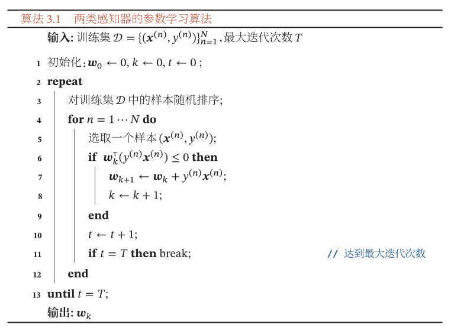

##### 公式3.1-3.2

$$
\begin{aligned}
f(\boldsymbol{x} ; \boldsymbol{w}) &=w_{1} x_{1}+w_{2} x_{2}+\cdots+w_{D} x_{D}+b \\
&=\boldsymbol{w}^{\top} \boldsymbol{x}+b
\end{aligned}
$$

**实例3.1-3.2**

```python
import numpy as np
import math

w = np.asarray([1, 2, 3])  # 权重向量
b = 1  # 偏置


def f(x):
    return np.vdot(w, x) + b


x = [1, 2, 3]  # 输入
f_x = f(x)  # 输出

print(f_x)
'''
15
'''
```

##### 公式3.3-3.5

$$
y=g(f(\boldsymbol{x} ; \boldsymbol{w}))\\
\begin{aligned}
g(f(\boldsymbol{x} ; \boldsymbol{w})) &=\operatorname{sgn}(f(\boldsymbol{x} ; \boldsymbol{w})) \\
& \triangleq\left\{\begin{array}{ll}
+1 & \text { if } f(\boldsymbol{x} ; \boldsymbol{w})>0 \\
-1 & \text { if } f(\boldsymbol{x} ; \boldsymbol{w})<0
\end{array}\right.
\end{aligned}
$$

**实例3.3-3.5**

```python
import numpy as np
import math


def f(x):
    w = np.asarray([1, 2, 3])  # 权重向量
    b = 1  # 偏置
    return np.vdot(w, x) + b


def sgn(x):  # 符号函数
    if x > 0:
        return 1
    elif x == 0:
        return 0
    else:
        return -1


y = 0  # 输出
x = [1, 2, 3]  # 输入

y = sgn(f(x))  # 公式3.3-3.5

print(y)
'''
1
'''
```

##### 公式3.6

$$
\gamma=\frac{f(\boldsymbol{x} ; \boldsymbol{w})}{\|\boldsymbol{w}\|}
$$

**实例3.6**

```python
import numpy as np
import math

w = np.array([1, 2, 3])  # 权重向量
b = 1  # 偏置


def f(x):
    return np.vdot(w, x) + b


gamma = 0  # 特征空间每个样本点到决策平面的有向距离
x = np.array([1, 2, 3])  # 输入
w_norm = np.linalg.norm(w)  # 权重向量的模/2范数

gamma = f(x) / w_norm  # 公式3.6

print(gamma)
'''
4.008918628686366
'''
```

##### 公式3.7

$$
\begin{array}{ll}
f\left(\boldsymbol{x}^{(n)} ; \boldsymbol{w}^{*}\right)>0 & \text { if } \quad y^{(n)}=1 \\
f\left(\boldsymbol{x}^{(n)} ; \boldsymbol{w}^{*}\right)<0 & \text { if } \quad y^{(n)}=-1
\end{array}
$$

**实例3.7**

```python
import numpy as np
import math

w = np.array([1, 2, 3])  # 权重向量
b = 1  # 偏置


def f(x):
    return np.vdot(w, x) + b


N = 3  # 样本数量
x = np.array([[1, 2, 3], [4, 5, 6], [7, 8, 9]])  # 输入
y = np.array([1, 1, -1])  # 类别


for n in range(N):
    if y[n] == 1:
        if f(x[n]) > 0:
            print("True")
        else:
            print("False")
    elif y[n] == -1:
        if f(x[n]) < 0:
            print("True")
        else:
            print("False")
    else:
        print("hyperplane")
'''
True
True
False
'''
```

##### 公式3.8

$$
y^{(n)} f\left(\boldsymbol{x}^{(n)} ; \boldsymbol{w}^{*}\right)>0, \quad \forall n \in[1, N]
$$

**实例3.8**

```python
import numpy as np
import math

w = np.array([1, 2, 3])  # 权重向量
b = 1  # 偏置


def f(x):
    return np.vdot(w, x) + b


N = 3  # 样本数量
x = np.array([[1, 2, 3], [4, 5, 6], [7, 8, 9]])  # 输入
y = np.array([1, 1, -1])  # 类别

for n in range(N):
    if y[n] * f(x[n]) > 0:
        print("True")
    elif y[n]*f(x[n]) < 0:
        print("False")
    else:
        print("hyperplane")

'''
True
True
False
'''
```

##### 公式3.9

$$
\mathcal{L}_{01}(y, f(\boldsymbol{x} ; \boldsymbol{w}))=I(y f(\boldsymbol{x} ; \boldsymbol{w})>0)
$$

**实例3.9**

```python
import numpy as np
import math

w = np.array([1, 2, 3])  # 权重向量
b = 1  # 偏置


def f(x):
    return np.vdot(w, x) + b


def I(y, f):  # 指示函数
    if y * f > 0:
        return 1
    else:
        return - 1


x = np.array([1, 2, 3])  # 输入
y = 1  # 类别

L_01 = I(y, f(x))  # 输出

print(L_01)
'''
1
'''
```

##### 公式3.10

$$
f_{c}\left(\boldsymbol{x} ; \boldsymbol{w}_{c}\right)=\boldsymbol{w}_{c}^{\top} \boldsymbol{x}+b_{c}, \quad c \in\{1, \cdots, C\}
$$

**实例3.10**

```python
import numpy as np
import math

w = np.array([[1, 1, 1], [-1, -1, -1], [0, 0, 0]])  # 权重向量
b = 1  # 偏置


def f(x, w_c):
    return np.vdot(w_c, x) + b


C = 3
f_c = np.zeros(C)
x = np.array([1, 2, 3])

for c in range(C):
    f_c[c] = f(x, w[c])

print(f_c)
'''
[ 7. -5.  1.]
'''
```

##### 公式3.11

$$
y=\underset{c=1}{\arg \max } f_{c}\left(\boldsymbol{x} ; \boldsymbol{w}_{c}\right)
$$

**实例3.11**

```python
import numpy as np
import math

w = np.array([[-1, -1, -1], [1, 1, 1], [0, 0, 0]])  # 权重向量
b = 1  # 偏置


def f(x, w_c):
    return np.vdot(w_c, x) + b


C = 3  # 类别数
f_c = np.zeros(C)  # 输出
x = np.array([1, 2, 3])  # 输入

for c in range(C):
    f_c[c] = f(x, w[c])

y = 0  # 预测类别
for c in range(1, C):
    if f_c[c] > f_c[y]:
        y = c

print(y)
'''
1
'''
```

##### 公式3.12

$$
p(y=1 \mid \boldsymbol{x})=g(f(\boldsymbol{x} ; \boldsymbol{w}))
$$

**实例3.12**

```python
import numpy as np
import math

w = np.array([1, 1, 1])  # 权重向量
b = 1  # 偏置


def f(x):  # 线性函数
    return np.vdot(w, x) + b


def g(x):  # 激活函数(以Logistic函数为例)
    return 1 / (1 + math.exp(-x))


x = np.array([1, 2, 3])  # 输入
p_x = g(f(x))  # 类别标签的后验概率

print(p_x)
'''
0.9990889488055994
'''
```

##### 公式3.13-3.14

$$
\begin{aligned}
p(y=1 \mid \boldsymbol{x}) &=\sigma\left(\boldsymbol{w}^{\top} \boldsymbol{x}\right) \\
& \triangleq \frac{1}{1+\exp \left(-\boldsymbol{w}^{\top} \boldsymbol{x}\right)}
\end{aligned}
$$

**实例3.13-3.14**

```python
import numpy as np
import math

w = np.array([1, 2, 3, 1])  # 增广权重向量


def f(x):  # 线性函数
    return np.vdot(w, x)


def sigma(x):  # 激活函数(以Logistic函数为例)
    return 1 / (1 + math.exp(-x))


x = np.array([1, 2, 3])  # 特征向量
x = np.concatenate((x, [1]), axis=0)  # 增广特征向量

p_1_x = sigma(f(x))  # 类别标签1的后验概率

print(p_1_x)
'''
0.999999694097773
'''
```

##### 公式3.15-3.16

$$
\begin{aligned}
p(y=0 \mid \boldsymbol{x}) &=1-p(y=1 \mid \boldsymbol{x}) \\
&=\frac{\exp \left(-\boldsymbol{w}^{\top} \boldsymbol{x}\right)}{1+\exp \left(-\boldsymbol{w}^{\top} \boldsymbol{x}\right)}
\end{aligned}
$$

**实例3.15-3.16**

```python
import numpy as np
import math

w = np.array([1, 2, 3, 1])  # 增广权重向量


def f(x):  # 线性函数
    return np.vdot(w, x)


def sigma(x):  # 激活函数(以Logistic函数为例)
    return 1 / (1 + math.exp(-x))


x = np.array([1, 2, 3])  # 特征向量
x = np.concatenate((x, [1]), axis=0)  # 增广特征向量

p_0_x = 1-sigma(f(x))  # 类别标签0的后验概率

print(p_0_x)
'''
3.059022269935596e-07
'''
```

##### 公式3.17-3.18

$$
\boldsymbol{w}^{\top} \boldsymbol{x}=\log \frac{p(y=1 \mid \boldsymbol{x})}{1-p(y=1 \mid \boldsymbol{x})}\\
=\log \frac{p(y=1 \mid \boldsymbol{x})}{p(y=0 \mid \boldsymbol{x})}
$$

**实例3.17-3.18**

```python
import numpy as np
import math

w = np.array([1, 2, 3, 1])  # 增广权重向量


def f(x):  # 线性函数
    return np.vdot(w, x)


def sigma(x):  # 激活函数(以Logistic函数为例)
    return 1 / (1 + math.exp(-x))


x = np.array([1, 2, 3])  # 特征向量
x = np.concatenate((x, [1]), axis=0)  # 增广特征向量

p_1_x = sigma(f(x))  # 类别标签1的后验概率
p_0_x = 1 - sigma(f(x))  # 类别标签0的后验概率

odds = math.log(p_1_x / p_0_x)  # 对数几率

f_x = f(x)

print(odds, f_x)
'''
14.99999999977792 15
'''
```

##### 公式3.19

$$
\hat{y}^{(n)}=\sigma\left(\boldsymbol{w}^{\top} \boldsymbol{x}^{(n)}\right), \quad 1 \leq n \leq N
$$

**实例3.19**

```python
import numpy as np
import math


def sigma(x):  # Logistic激活函数
    return 1 / (1 + math.exp(-x))


x = np.array([[0.1, 0.2, 0.3], [0.4, 0.5, 0.6], [0.7, 0.8, 0.9]])  # 特征向量
x = np.concatenate((x, np.ones((3, 1))), axis=1)  # 增广特征向量
w = np.array([1, 2, 3, 1])  # 增广权重向量

N = 3  # 样本数量
y = np.zeros(N)  # 类别标签1的后验概率
for n in range(N):
    y[n] = sigma(np.vdot(w, x[n]))

print(y)
'''
[0.9168273  0.98522597 0.99752738]
'''
```

##### 公式3.20-3.21

$$
\begin{array}{l}
p_{r}\left(y^{(n)}=1 \mid \boldsymbol{x}^{(n)}\right)=y^{(n)} \\
p_{r}\left(y^{(n)}=0 \mid \boldsymbol{x}^{(n)}\right)=1-y^{(n)}
\end{array}
$$

**实例3.20-3.21**

```python
import numpy as np
import math

x = np.array([[0.1, 0.2, 0.3], [0.4, 0.5, 0.6], [0.7, 0.8, 0.9]])  # 特征向量
x = np.concatenate((x, np.ones((3, 1))), axis=1)  # 增广特征向量
y = np.array([1, 0, 1])  # 类别标签

N = 3  # 训练集数量
p_r_1 = np.zeros(N)  # 标签1的真实条件概率
p_r_0 = np.zeros(N)  # 标签0的真实条件概率
for n in range(N):
    p_r_1[n] = y[n]
    p_r_0[n] = 1 - y[n]

print(p_r_1)
print(p_r_0)
'''
[1. 0. 1.]
[0. 1. 0.]
'''
```

##### 公式3.22-3.33

$$
\mathcal{R}(\boldsymbol{w})=-\frac{1}{N} \sum_{n=1}^{N}\left(p_{r}\left(y^{(n)}=1 \mid \boldsymbol{x}^{(n)}\right) \log \hat{y}^{(n)}+p_{r}\left(y^{(n)}=0 \mid \boldsymbol{x}^{(n)}\right) \log \left(1-\hat{y}^{(n)}\right)\right)\\
=-\frac{1}{N} \sum_{n=1}^{N}\left(y^{(n)} \log \hat{y}^{(n)}+\left(1-y^{(n)}\right) \log \left(1-\hat{y}^{(n)}\right)\right)
$$

**实例3.22**

```python
import numpy as np
import math


def sigma(x):  # Logistic激活函数
    return 1 / (1 + math.exp(-x))


x_train = np.array([[0.1, 0.2, 0.3], [0.4, 0.5, 0.6], [0.7, 0.8, 0.9]])  # 特征向量
x_train = np.concatenate((x_train, np.ones((3, 1))), axis=1)  # 增广特征向量
y_train = np.array([1, 0, 1])  # 类别标签
w = np.array([1, 2, 3, 1])  # 增广权重向量

N = 3  # 训练集数量
y_predict = np.zeros(N)  # 类别标签1的后验概率
for n in range(N):
    y_predict[n] = sigma(np.vdot(w, x_train[n]))

sum = 0
for n in range(N):
    sum += y_train[n] * math.log(y_predict[n]) + \
        (1 - y_train[n]) * math.log(1 - y_predict[n])
R_w = -sum / N  # 交叉熵损失函数

print(R_w)
'''
1.4347320306545324
'''

```

##### 公式3.24-3.26

$$
\begin{aligned}
\frac{\partial \mathcal{R}(\boldsymbol{w})}{\partial \boldsymbol{w}} &=-\frac{1}{N} \sum_{n=1}^{N}\left(y^{(n)} \frac{\hat{y}^{(n)}\left(1-\hat{y}^{(n)}\right)}{\hat{y}^{(n)}} \boldsymbol{x}^{(n)}-\left(1-y^{(n)}\right) \frac{\hat{y}^{(n)}\left(1-\hat{y}^{(n)}\right)}{1-\hat{y}^{(n)}} \boldsymbol{x}^{(n)}\right) \\
&=-\frac{1}{N} \sum_{n=1}^{N}\left(y^{(n)}\left(1-\hat{y}^{(n)}\right) \boldsymbol{x}^{(n)}-\left(1-y^{(n)}\right) \hat{y}^{(n)} \boldsymbol{x}^{(n)}\right) \\
&=-\frac{1}{N} \sum_{n=1}^{N} \boldsymbol{x}^{(n)}\left(\boldsymbol{y}^{(n)}-\hat{y}^{(n)}\right)
\end{aligned}
$$

**实例3.24-3.26**

```python
import numpy as np
import math


def sigma(x):  # Logistic激活函数
    return 1 / (1 + math.exp(-x))


N = 3  # 训练集数量
x_train = np.array([[0.1, 0.2, 0.3], [0.4, 0.5, 0.6], [0.7, 0.8, 0.9]])  # 特征向量
x_train = np.concatenate((x_train, np.ones((N, 1))), axis=1)  # 增广特征向量
y_train = np.array([1, 0, 1])  # 类别标签
w = np.array([1, 2, 3, 1])  # 增广权重向量

y_predict = np.zeros(N)  # 类别标签1的后验概率
for n in range(N):
    y_predict[n] = sigma(np.vdot(w, x_train[n]))

sum = np.zeros_like(x_train[0])  # 损失的和
for n in range(N):
    sum += x_train[n] * (y_train[n] - y_predict[n])

R_w_diff = -sum / N  # 损失函数关于权重向量的偏导数

print(R_w_diff)
'''
[0.12801409 0.15800012 0.18798614 0.29986022]
'''
```

##### 公式3.27

$$
\boldsymbol{w}_{t+1} \leftarrow \boldsymbol{w}_{t}+\alpha \frac{1}{N} \sum_{n=1}^{N} \boldsymbol{x}^{(n)}\left(y^{(n)}-\hat{y}_{\boldsymbol{w}_{t}}^{(n)}\right)
$$

**实例3.27**

```python
import numpy as np
import math


def sigma(x):  # Logistic激活函数
    return 1 / (1 + math.exp(-x))


alpha = 0.5  # 学习率
N = 3  # 训练集数量
x_train = np.array(
    [[0.1, 0.2, 0.3], [-0.4, -0.5, -0.6], [0.7, 0.8, 0.9]])  # 特征向量
x_train = np.concatenate((x_train, np.ones((N, 1))), axis=1)  # 增广特征向量
y_train = np.array([1, 0, 1])  # 类别标签
w = np.array([-0.1, 0.2, -0.3, 0.5], dtype=float)  # 增广权重向量


T = 10  # 训练轮数
for t in range(T):
    y_predict = np.zeros(N)  # 类别标签1的后验概率
    for n in range(N):
        y_predict[n] = sigma(np.vdot(w, x_train[n]))

    sum = np.zeros_like(x_train[0])  # 损失的和
    for n in range(N):
        sum += x_train[n] * (y_train[n] - y_predict[n])

    w += alpha * sum / N  # 更新权重
    print(y_predict)
'''
[0.60825903 0.65021855 0.57932425]
[0.63318576 0.61233977 0.65653881]
[0.65295863 0.57578564 0.71714826]
[0.66895553 0.54105732 0.76437727]
[0.68221053 0.50846591 0.80137089]
[0.69346319 0.47816452 0.83065886]
[0.70323397 0.45018472 0.85414002]
[0.7118888  0.42447157 0.8732071 ]
[0.71968664 0.40091377 0.88887866]
[0.72681262 0.37936736 0.90190439]
'''
```

##### 公式3.28-3.29

$$
\begin{aligned}
p(y=c \mid \boldsymbol{x}) &=\operatorname{softmax}\left(\boldsymbol{w}_{c}^{\top} \boldsymbol{x}\right) \\
&=\frac{\exp \left(\boldsymbol{w}_{c}^{\top} \boldsymbol{x}\right)}{\sum_{c^{\prime}=1}^{C} \exp \left(\boldsymbol{w}_{c^{\prime}}^{\top} \boldsymbol{x}\right)}
\end{aligned}
$$

**实例3.28-3.29**

```python
import numpy as np
import math

N = 1  # 训练集数量
C = 3  # 类别数量
x_train = np.array([0.1, 0.2, 0.3])  # 特征向量
x_train = np.concatenate((x_train, np.ones(1)), axis=0)  # 增广特征向量
y_train = np.array(2)  # 类别标签
w = np.array([[-0.1, 0.2, -0.3, 0.5], [-0.1, 0.2, 0.3, 0.4],
              [0.2, 0.3, 0.4, 0.5]], dtype=float)  # 增广权重向量


def softmax(w_c_x):  # Softmax函数
    sum = 0
    for c in range(C):
        sum += math.exp(np.vdot(w[c], x_train))
    return math.exp(w_c_x) / sum


p_c_x = np.zeros(C)  # 预测属于类别c的条件概率
for c in range(C):
    p_c_x[c] = softmax(np.vdot(w[c], x_train))

print(p_c_x)
'''
[0.29583898 0.32047854 0.38368248]
'''
```

##### 公式3.30-3.31

$$
\begin{aligned}
\hat{y} &=\underset{c=1}{\arg \max } p(y=c \mid \boldsymbol{x}) \\
&=\underset{c=1}{\arg \max } \boldsymbol{w}_{c}^{\top} \boldsymbol{x}
\end{aligned}
$$

**实例3.30-3.31**

```python
import numpy as np
import math

N = 1  # 训练集数量
C = 3  # 类别数量
x_train = np.array([0.1, 0.2, 0.3])  # 特征向量
x_train = np.concatenate((x_train, np.ones(1)), axis=0)  # 增广特征向量
y_train = np.array(2)  # 类别标签
w = np.array([[-0.1, 0.2, -0.3, 0.5], [-0.1, 0.2, 0.3, 0.4],
              [0.2, 0.3, 0.4, 0.5]], dtype=float)  # 增广权重向量


temp = np.zeros(C)
for c in range(C):
    temp[c] = np.vdot(w[c], x_train)

y_predict = np.argmax(temp)  # 预测类别
print(y_predict)
'''
2
'''
```

##### 公式3.32-3.34

$$
\begin{aligned}
\hat{y} &=\underset{y \in\{0,1\}}{\arg \max } \boldsymbol{w}_{y}^{\top} \boldsymbol{x} \\
&=I\left(\boldsymbol{w}_{1}^{\top} \boldsymbol{x}-\boldsymbol{w}_{0}^{\top} \boldsymbol{x}>0\right) \\
&=I\left(\left(\boldsymbol{w}_{1}-\boldsymbol{w}_{0}\right)^{\top} \boldsymbol{x}>0\right)
\end{aligned}
$$

**实例3.32-3.34**

```python
import numpy as np
import math

N = 1  # 训练集数量
C = 2  # 类别数量

x_train = np.array([0.1, 0.2, 0.3])  # 特征向量
x_train = np.concatenate((x_train, np.ones(1)), axis=0)  # 增广特征向量
y_train = np.array(1)  # 类别标签
w = np.array([[-0.1, 0.2, -0.3, 0.5], [-0.1, 0.2, 0.3, 0.4]],
             dtype=float)  # 增广权重向量


def I(x):#指示函数
    if x > 0:
        return 1
    else:
        return - 1
        
y_predict = I(np.vdot(w[1] - w[0], x_train))

print(y_predict)
```

##### 公式3.35-3.36

$$
\begin{aligned}
\hat{y} &=\operatorname{softmax}\left(W^{\top} x\right) \\
&=\frac{\exp \left(W^{\top} x\right)}{1_{C}^{\top} \exp \left(W^{\top} x\right)}
\end{aligned}
$$

**实例3.35-3.36**

```python
import numpy as np

N = 1  # 训练集数量
C = 3  # 类别数量
x_train = np.array([1, 2, 3])  # 特征向量
x_train = np.concatenate((x_train, np.ones(1)), axis=0)  # 增广特征向量
y_train = np.array(2)  # 类别标签
W = np.array([[-1, 1, -1, 1], [-1, 1, 1, 1],
              [1, 1, 1, 1]], dtype=float)  # 增广权重向量组成的矩阵


def softmax(W_x):  # Softmax函数
    return np.exp(W_x) / (np.vdot(np.ones(C), np.exp(W_x)))


y_predict = softmax(np.dot(W, x_train.T))  # 所有类别的预测条件概率组成的向量

print(y_predict)
'''
[2.95387223e-04 1.19167711e-01 8.80536902e-01]
'''
```

##### 公式3.37

$$
\boldsymbol{y}=[I(1=c), I(2=c), \cdots, I(C=c)]^{\top}
$$

**实例3.37**

```python
import numpy as np

C = 3  # 类别数
y_train = 1  # 一个训练样本标签
y_train_v = np.zeros(C)  # 标签对应的one-hot向量
y_train_v[y_train] = 1

print(y_train_v)
'''
[0. 1. 0.]
'''
```

##### 公式3.38-3.39

$$
\begin{aligned}
\mathcal{R}(\boldsymbol{W}) &=-\frac{1}{N} \sum_{n=1}^{N} \sum_{c=1}^{C} \boldsymbol{y}_{c}^{(n)} \log \hat{\boldsymbol{y}}_{c}^{(n)} \\
&=-\frac{1}{N} \sum_{n=1}^{N}\left(\boldsymbol{y}^{(n)}\right)^{\top} \log \hat{\boldsymbol{y}}^{(n)}
\end{aligned}
$$

**实例3.38-3.39**

```python
import numpy as np


def softmax(W_x, C):  # Softmax函数
    return np.exp(W_x) / (np.vdot(np.ones(C), np.exp(W_x)))


'''1.数据预处理'''
# 训练样本数量
N = 3
# 类别数量
C = 3
# 学习率
alpha = 0.1
# 特征向量组成的矩阵
x_train = np.array([[1, 4, 7],
                    [2, 5, 8],
                    [3, 6, 9]], dtype=float)
# 增广特征向量组成的矩阵
x_train = np.concatenate((x_train, np.ones((1, N))), axis=0)
# 类别标签组成的向量
y_train = np.array([[0],
                    [1],
                    [2]])
# 标签对应的one-hot向量组成的标签矩阵
y_train_v = np.zeros((C, N))
for n in range(N):
    y_train_v[n, y_train[n]] = 1
# 增广权重向量组成的矩阵
W = np.array([[-1, 1, 1],
              [1, -1, 1],
              [1, 1, -1],
              [1, 1, 1]], dtype=float)


'''2.计算损失'''
# N个样本类别标签的后验概率向量组成的矩阵
y_predict = np.zeros((C, N))
for n in range(N):
    y_predict[:, n] = softmax(np.dot(W.T, x_train[:, n]), C)

# 损失函数关于去增广权重矩阵的梯度
sum = 0
for n in range(N):
    sum += np.vdot(y_train_v[:, n], np.log(y_predict[:, n]))
R_W = -sum / N

print(R_W)
'''
2.1429316284998996
'''
```

##### 公式3.40

$$
\frac{\partial \mathcal{R}(\boldsymbol{W})}{\partial \boldsymbol{W}}=-\frac{1}{N} \sum_{n=1}^{N} \boldsymbol{x}^{(n)}\left(\boldsymbol{y}^{(n)}-\hat{\boldsymbol{y}}^{(n)}\right)^{\top}
$$

**实例3.40**

```python
import numpy as np


def softmax(W_x, C):  # Softmax函数
    return np.exp(W_x) / (np.vdot(np.ones(C), np.exp(W_x)))


'''1.数据预处理'''
# 训练样本数量
N = 3
# 类别数量
C = 3
# 学习率
alpha = 0.1
# 特征向量组成的矩阵
x_train = np.array([[1, 4, 7],
                    [2, 5, 8],
                    [3, 6, 9]], dtype=float)
# 增广特征向量组成的矩阵
x_train = np.concatenate((x_train, np.ones((1, N))), axis=0)
# 类别标签组成的向量
y_train = np.array([[0],
                    [1],
                    [2]])
# 标签对应的one-hot向量组成的标签矩阵
y_train_v = np.zeros((C, N))
for n in range(N):
    y_train_v[n, y_train[n]] = 1
# 增广权重向量组成的矩阵
W = np.array([[-1, 1, 1],
              [1, -1, 1],
              [1, 1, -1],
              [1, 1, 1]], dtype=float)


'''2.计算梯度'''
# N个样本类别标签的后验概率向量组成的矩阵
y_predict = np.zeros((C, N))
for n in range(N):
    y_predict[:, n] = softmax(np.dot(W.T, x_train[:, n]), C)

# 损失函数关于去增广权重矩阵的梯度
sum = np.zeros((N+1, C))
for n in range(N):
    sum += np.dot(np.array([x_train[:, n]]).T,
                  np.array([y_train_v[:, n] - y_predict[:, n]]))
R_W_diff = -sum / N

print(R_W_diff)
'''
[[ 3.13392    -0.86409162 -2.26982837]
 [ 3.66739999 -1.08011453 -2.58728547]
 [ 4.20087999 -1.29613743 -2.90474256]
 [ 0.53348    -0.21602291 -0.31745709]]
'''
```

##### 公式3.53

$$
\boldsymbol{W}_{t+1} \leftarrow \boldsymbol{W}_{t}+\alpha\left(\frac{1}{N} \sum_{n=1}^{N} \boldsymbol{x}^{(n)}\left(\boldsymbol{y}^{(n)}-\hat{\boldsymbol{y}}_{\boldsymbol{W}_{i}}^{(n)}\right)^{\top}\right)
$$

**实例3.53**

```python
import numpy as np


def softmax(W_x, C):  # Softmax函数
    return np.exp(W_x) / (np.vdot(np.ones(C), np.exp(W_x)))


'''1.数据预处理'''
# 训练样本数量
N = 3
# 类别数量
C = 3
# 学习率
alpha = 0.1
# 特征向量组成的矩阵shape=(d,N)
x_train = np.array([[1, 4, 7],
                    [2, 5, 8],
                    [3, 6, 9]], dtype=float)
# 增广特征向量组成的矩阵shape=(d+1,N)
x_train = np.concatenate((x_train, np.ones((1, N))), axis=0)
# 类别标签组成的向量shape=(3,1)
y_train = np.array([[0],
                    [1],
                    [2]])
# 标签对应的one-hot向量组成的标签矩阵shape=(C,N)
y_train_v = np.zeros((C, N))
for n in range(N):
    y_train_v[n, y_train[n]] = 1
# 增广权重向量组成的矩阵shape=(d+1,C)
W = np.array([[-1, 1, 1],
              [1, -1, 1],
              [1, 1, -1],
              [1, 1, 1]], dtype=float)


'''2.更新权重'''
T = 1000  # 迭代次数
for t in range(T):

    # N个样本类别标签的后验概率向量组成的矩阵
    y_predict = np.zeros((C, N))
    for n in range(N):
        y_predict[:, n] = softmax(np.dot(W.T, x_train[:, n]), C)

    # 损失函数关于去增广权重矩阵的梯度
    sum = np.zeros((N+1, C))
    for n in range(N):
        sum += np.dot(x_train[:, n, np.newaxis],
                      y_train_v[np.newaxis, :, n, ] - y_predict[np.newaxis, :, n])
    R_W_diff = -sum / N

    # 更新权重
    W -= alpha * (R_W_diff)

print(W)
'''
[[-3.9315008   0.6852424   4.2462584 ]
 [ 0.3024222  -0.93875331  1.6363311 ]
 [ 2.5363452   1.43725099 -2.97359619]
 [ 3.233923    1.37600429 -1.60992729]]
'''

for n in range(N):
    print(np.argmax(y_train_v[:, n]), np.argmax(y_predict[:, n]))
'''
0 0
1 1
2 2
'''
```

##### 公式3.54

$$
\hat{y}=\operatorname{sgn}\left(\boldsymbol{w}^{\top} \boldsymbol{x}\right)
$$

**实例3.54**

```python
import numpy as np


def sgn(x):
    '''
    符号函数
    '''
    if x > 0:
        return 1
    elif x == 0:
        return 0
    else:
        return -1


# 输入特征向量
x = np.array([[1],
              [2],
              [3]], dtype=float)
# 增广特征向量
x = np.concatenate((x, np.ones((1, 1))), axis=0)
# 增广权重向量
w = np.array([[1],
              [2],
              [3],
              [1]], dtype=float)
# 预测类别标签
y_predict = sgn(np.vdot(w, x))

print(y_predict)
'''
1
'''
```

##### 公式3.55

$$
y^{(n)} \boldsymbol{w}^{*^{\top}} \boldsymbol{x}^{(n)}>0, \quad \forall n \in\{1, \cdots, N\}
$$

**实例3.55**

```python
import numpy as np

'''1.数据预处理'''
# 训练样本数量
N = 3
# 学习率
alpha = 0.1
# 特征向量组成的矩阵shape=(d,N)
x_train = np.array([[1, 4, 7],
                    [2, 5, 8],
                    [3, 6, 9]], dtype=float)
# 增广特征向量组成的矩阵shape=(d+1,N)
x_train = np.concatenate((x_train, np.ones((1, N))), axis=0)
# 类别标签组成的向量shape=(3,1)
y_train = np.array([[-1],
                    [1],
                    [1]])
# 增广权重向量shape=(d+1,1)
w = np.array([[-1],
              [1],
              [1],
              [1]], dtype=float)

for n in range(N):
    if y_train[n] * np.vdot(w, x_train[:, n]) > 0:
        print("True")
    else:
        print("False")
'''
False
True
True
'''
```

##### 公式3.56

$$
\boldsymbol{w} \leftarrow \boldsymbol{w}+y \boldsymbol{x}
$$

```python
import numpy as np

'''1.数据预处理'''
# 训练样本数量
N = 3
# 学习率
alpha = 0.1
# 特征向量组成的矩阵shape=(d,N)
x_train = np.array([[1, 4, 7],
                    [2, 5, 8],
                    [3, 6, 9]], dtype=float)
# 增广特征向量组成的矩阵shape=(d+1,N)
x_train = np.concatenate((x_train, np.ones((1, N))), axis=0)
# 类别标签组成的向量shape=(3,1)
y_train = np.array([[-1],
                    [1],
                    [1]])
# 增广权重向量shape=(d+1,1)
w = np.array([[0],
              [0],
              [0],
              [0]], dtype=float)

'''2.更新权重'''
T = 10  # 迭代次数
for t in range(T):
    for n in range(N):
        if y_train[n] * np.vdot(w, x_train[:, n]) <= 0:  # 错分样本
            w += y_train[n, 0] * x_train[:, n, np.newaxis]  # 更新权重
print(w)
'''
[[ 5.]
 [ 1.]
 [-3.]
 [-4.]]
'''
```

##### 公式3.57

$$
\mathcal{L}(\boldsymbol{w} ; \boldsymbol{x}, y)=\max \left(0,-y \boldsymbol{w}^{\top} \boldsymbol{x}\right)
$$

**实例3.57**

```python
import numpy as np

'''1.数据预处理'''
# 训练样本数量
N = 3
# 学习率
alpha = 0.1
# 特征向量组成的矩阵shape=(d,N)
x_train = np.array([[1, 4, 7],
                    [2, 5, 8],
                    [3, 6, 9]], dtype=float)
# 增广特征向量组成的矩阵shape=(d+1,N)
x_train = np.concatenate((x_train, np.ones((1, N))), axis=0)
# 类别标签组成的向量shape=(3,1)
y_train = np.array([[-1],
                    [-1],
                    [1]])
# 增广权重向量shape=(d+1,1)
w = np.array([[0],
              [-1],
              [0],
              [-1]], dtype=float)
# 累积损失
loss = 0  
for n in range(N):
    loss += max(0, -y_train[n, 0] * np.vdot(w, x_train[:, n]))
print(loss)
'''
9.0
'''
```

##### 公式3.58

$$
\frac{\partial \mathcal{L}(\boldsymbol{w} ; \boldsymbol{x}, y)}{\partial \boldsymbol{w}}=\left\{\begin{array}{ll}
0 & \text { if } \quad y \boldsymbol{w}^{\top} \boldsymbol{x}>0 \\
-y \boldsymbol{x} & \text { if } \quad y \boldsymbol{w}^{\top} \boldsymbol{x}<0
\end{array}\right.
$$

**实例3.58**

```python
import numpy as np

'''1.数据预处理'''
# 训练样本数量
N = 3
# 样本特征维度
D = 3
# 学习率
alpha = 0.1
# 特征向量组成的矩阵shape=(d,N)
x_train = np.array([[1, 4, 7],
                    [2, 5, 8],
                    [3, 6, 9]], dtype=float)
# 增广特征向量组成的矩阵shape=(d+1,N)
x_train = np.concatenate((x_train, np.ones((1, N))), axis=0)
# 类别标签组成的向量shape=(3,1)
y_train = np.array([[-1],
                    [-1],
                    [1]])
# 增广权重向量shape=(d+1,1)
w = np.array([[0],
              [-1],
              [0],
              [-1]], dtype=float)
# 梯度向量
loss_w_diff = np.zeros(D+1)
for n in range(N):
    if y_train[n, 0] * np.vdot(w, x_train[:, n]) > 0:
        loss_w_diff = np.zeros((4, 1))
    else:
        loss_w_diff = -y_train[n, 0] * x_train[:, n, np.newaxis]
    print(loss_w_diff)

'''
[[0.]
 [0.]
 [0.]
 [0.]]
[[0.]
 [0.]
 [0.]
 [0.]]
[[-7.]
 [-8.]
 [-9.]
 [-1.]]
'''
```

##### 算法3.1



**算法3.1实例**

```python


```

##### 公式3.78-3.80

$$
\hat{\boldsymbol{y}}=\underset{\boldsymbol{y} \in \operatorname{Gen}(\boldsymbol{x})}{\arg \max } \boldsymbol{w}^{\top} \boldsymbol{\phi}(\boldsymbol{x}, \boldsymbol{y})\\
\phi(\boldsymbol{x}, \boldsymbol{y})=\operatorname{vec}\left(\boldsymbol{x} \boldsymbol{y}^{\top}\right) \in \mathbb{R}^{(D \times C)}\\
$$

**实例3.78-3.80**

```python
import numpy as np

'''1.数据预处理'''
# 训练样本数量
N = 4
# 类别数
C = 4
# 特征维度
D = 3
# 学习率
alpha = 0.1
# 特征向量组成的矩阵shape=(N,D)
x_train = np.array([[1, 2, 3],
                    [4, 5, 6],
                    [-7, -8, -9],
                    [10, 11, 12]], dtype=float)
# 类别标签组成的向量
y_train = np.array([1, 2, 0, 3])
# 标签对应的one-hot向量组成的标签矩阵
y_train_v = np.zeros((N, C))
for n in range(N):
    y_train_v[n, y_train[n]] = 1
# 权重向量shape=(C*D)
w = np.ones((C * D), dtype=float) * 0.01

# y.shape=(N,C)
# y.T.shape=(C,N)
# x.shape=(N,D)

y = np.diag(np.ones(C))
# print(y)

for n in range(N):
    y_predict = y[0]
    max = -np.inf
    for c in range(C):
        phi = np.reshape(np.outer(x_train[n], y[c]).T, (C * D))
        temp = np.vdot(w, phi)
        if temp > max:
            max = temp
            y_predict = y[c]
    print(y_predict)
'''
[0. 1. 0. 0.]
[1. 0. 0. 0.]
[0. 1. 0. 0.]
[1. 0. 0. 0.]
'''
```

