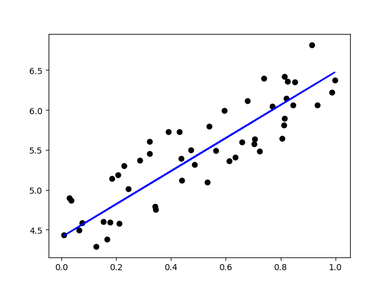

#### 线性回归-普通最小二乘法

+ **code**

```
import matplotlib.pyplot as plt
import numpy as np
from sklearn import linear_model
from sklearn.metrics import mean_squared_error
from mpl_toolkits.mplot3d import Axes3D

X = np.array([[0, 1, 2, 3, 4, 5, 6, 7, 8, 9],
              [0, 1, 2, 3, 4, 5, 6, 7, 8, 9],
              [1, 1, 1, 1, 1, 1, 1, 1, 1, 1]])
X_train = X[:,0:5].T
X_test = X[:,5:10].T
y = np.array([1, 3, 5, 7, 9, 11, 13, 15, 17, 19])
y_train = y[:-5]
y_test = y[-5:]

regr = linear_model.LinearRegression()
regr.fit(X_train, y_train)
y_pred = regr.predict(X_test)
print('y=%.1f(x1)+%.1f(x2)+%.1f' % (regr.coef_[0], regr.coef_[1], regr.intercept_))
print(y.shape, X.shape, regr.coef_.shape)
print("MSE= %.1f" % mean_squared_error(y_test, y_pred))

# 画三维图
fig = plt.figure()
ax = Axes3D(fig)
ax.scatter(X_test[:, 0], X_test[:, 1], y_test, color='black')
ax.plot(X_test[:, 0], X_test[:, 1], y_pred, color='blue', linewidth=3)
plt.show()

# 画二维图
# plt.scatter(x, y,  color='black')#二维散点
# plt.plot(x, y, color='blue', linewidth=3)
# plt.show()
```

+ **output**

```
y=1.0(x1)+1.0(x2)+1.0
(10,) (10, 3) (3,)
MSE= 0.0
```

