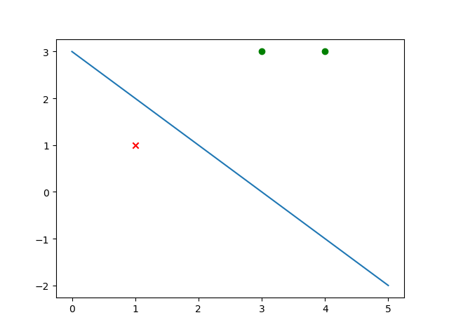

**感知机代码**

+ 感知机算法的原始形式
+ 感知机算法的对偶形式

```python
import numpy as np
import matplotlib.pyplot as plt


class Perceptron(object):
    def __init__(self):
        self.eta = 1
        self.max_iteration = 100

    def original_train(self, x, y):
        w = np.zeros(x.shape[1])
        b = 0
        count_iteration = 0
        while count_iteration < self.max_iteration:
            false_count = 0
            for i in range(x.shape[0]):
                if y[i] * (np.dot(w, x[i, :].T) + b) <= 0:
                    w = w + self.eta * y[i] * x[i]
                    b = b + self.eta * y[i]
                    count_iteration = count_iteration + 1
                    false_count = false_count + 1
                    print("迭代次数%d,误分类点x%d,w=%s,b=%d" %
                          (count_iteration, i + 1, w, b))
            if false_count == 0:
                break
        return w, b, count_iteration

    def dual_train(self, x, y):
        G = np.zeros([x.shape[0], x.shape[0]])
        for i in range(x.shape[0]):
            for j in range(x.shape[0]):
                G[i][j] = np.dot(x[i, :], x[j, :].T)
        print(G)
        a = np.zeros(x.shape[0])
        b = 0
        count_iteration = 0
        while count_iteration < self.max_iteration:
            false_count = 0
            for i in range(x.shape[0]):
                if y[i] * (np.dot(a * y, G[i, :].T) + b) <= 0:
                    a[i] = a[i] + self.eta
                    b = b + self.eta * y[i]
                    count_iteration = count_iteration + 1
                    false_count = false_count + 1
                    print("迭代次数%d,误分类点x%d,a=%s,b=%d" %
                          (count_iteration, i + 1, a, b))
            if false_count == 0:
                break
        w = np.dot(a * y, x)
        return w, b, count_iteration

    def draw(self, x, y, w, b):
        for i in range(x.shape[0]):
            if y[i] == 1:
                plt.scatter(x[i, 0], x[i, 1], marker='o', c='green')
            else:
                plt.scatter(x[i, 0], x[i, 1], marker='x', c='red')
        X = np.linspace(0, 5)
        Y = -w[0] / w[1] * X - b / w[1]
        plt.plot(X, Y)
        plt.show()


if __name__ == "__main__":
    model = Perceptron()
    x = np.array([[3, 3], [4, 3], [1, 1]])
    y = np.array([1, 1, -1])
    [w, b, count_iteration] = model.original_train(x, y)
    print("迭代次数=%d,w=%s,b=%d" % (count_iteration, w, b))
    [w, b, count_iteration] = model.dual_train(x, y)
    print("迭代次数%d,w=%s,b=%d" % (count_iteration, w, b))
    model.draw(x, y, w, b)

```

**输出**

```
迭代次数1,误分类点x1,w=[3. 3.],b=1
迭代次数2,误分类点x3,w=[2. 2.],b=0
迭代次数3,误分类点x3,w=[1. 1.],b=-1
迭代次数4,误分类点x3,w=[0. 0.],b=-2
迭代次数5,误分类点x1,w=[3. 3.],b=-1
迭代次数6,误分类点x3,w=[2. 2.],b=-2
迭代次数7,误分类点x3,w=[1. 1.],b=-3
迭代次数=7,w=[1. 1.],b=-3
[[18. 21.  6.]
 [21. 25.  7.]
 [ 6.  7.  2.]]
迭代次数1,误分类点x1,a=[1. 0. 0.],b=1
迭代次数2,误分类点x3,a=[1. 0. 1.],b=0
迭代次数3,误分类点x3,a=[1. 0. 2.],b=-1
迭代次数4,误分类点x3,a=[1. 0. 3.],b=-2
迭代次数5,误分类点x1,a=[2. 0. 3.],b=-1
迭代次数6,误分类点x3,a=[2. 0. 4.],b=-2
迭代次数7,误分类点x3,a=[2. 0. 5.],b=-3
迭代次数7,w=[1. 1.],b=-3
```



```java
import java.util.ArrayList;
import java.util.Arrays;
import java.util.List;

public class Perceptron {
    static double ETA = 1;
    static int MAX_ITERATION = 100;

    public static void main(String[] args) {
        List<double[]> x = new ArrayList<>();
        x.add(new double[]{3, 3});
        x.add(new double[]{4, 3});
        x.add(new double[]{1, 1});
        int[] y = new int[]{1, 1, -1};
        double[] w = new double[2];
        double b = 0;
        int countIteration = 0;

        while (countIteration < MAX_ITERATION) {
            int falseCount = 0;
            for (int i = 0; i < x.size(); i++) {
                if (y[i] * (dot(w, x.get(i)) + b) <= 0) {
                    for (int j = 0; j < w.length; j++) {
                        w[j] = w[j] + ETA * y[i] * x.get(i)[j];
                    }
                    b = b + ETA * y[i];
                    countIteration++;
                    falseCount++;
                    System.out.printf("迭代次数%d,误分类点x%d,w=%s,b=%.2f\n", countIteration, i + 1, Arrays.toString(w), b);
                }
            }
            System.out.println("falseCount=" + falseCount);
            if (falseCount == 0) {
                break;
            }
        }
    }

    static double dot(double[] w, double[] x) {
        double s = 0;
        for (int i = 0; i < w.length; i++) {
            s = s + w[i] * x[i];
        }
        return s;
    }
}
```

