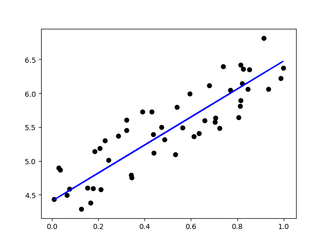

**2.感知机**

+ 感知机：二类分类的线性分类模型，对应于输入空间中将实例划分为正负两类的分离超平面，属于判别模型。
+ 输入：实例的特征向量。
+ 输出：实例的类别。
+ 模型选择：使用梯度下降法对损失函数进行极小化。
+ 形式：原始和对偶。

**2.1 感知机模型**

+ 模型：二类分类的线性分类模型，属于判别模型。

+ 假设空间：定义在特征空间中的所有线性分类模型或者线性分类器，即$F=\{f|f(x)=wx+b\}$

+ 符号说明：
  + 输入空间为$X \subseteq \R ^{n}$，输入实例为$x\in X$
  + 输出空间为$Y=\{+1,-1\}$，实例类别为$y\in Y$
  + 感知机参数：权值为$w\in \R^{n}$，偏置为$b\in \R$
  + 符号函数为$sign$

+ 感知机函数
  $$
  f(x)=\operatorname{sign}(w \cdot x+b)\\
  \operatorname{sign}(x)=\left\{\begin{array}{ll}
  +1, & x \geqslant 0 \\
  -1, & x<0
  \end{array}\right.
  $$
  
+ 几何解释：感知机是线性方程$w\cdot x+b=0$对应于特征空间$\R^n$中的一个超平面$S$，其中$w$是超平面的法向量，$b$是超平面的截距。

  

**2.2感知机学习策略**

**1.数据集的线性可分性**

存在超平面$S$将数据集的正实例点和负实例点完全正确的划分到超平面的两侧。

**2.感知机学习策略**

+ 学习策略：在线性分类器的假设空间中选择使损失函数最小的模型参数。

+ 选择损失函数：

  + 误分类点的总数。——不是关于参数的连续可导函数，不易优化。
  + 误分类点到超平面$S$的总距离。——是关于参数的连续可导函数，容易优化。

+ 损失函数：误分类点到超平面$S$的距离$-\frac{y_{i}\left(w \cdot x_{i}+b\right)}{\|w\|} $。

+ 输入空间$R^n$中任意一点$x_0$到超平面$S$的距离为$\frac{\left|w \cdot x_{0}+b\right|}{\|w\|}$

+ 为什么误分类样本$(x_i,y_i)$要满足$-y_{i}\left(w \cdot x_{i}+b\right)>0$或者$y_i(w\cdot x_i+b)<0$？
  $$
  当w\cdot x_i+b>0,y_i=-1时表示将负类预测为正类。\\
  当w\cdot x_i+b<0,y_i=+1时表示将正类预测为负类。\\
  误分类样本=将正类预测为负类+将负类预测为正类。
  $$

+ 为什么误分类点$x_i$到超平面$S$的距离是$-\frac{y_{i}\left(w \cdot x_{i}+b\right)}{\|w\|} $？
  $$
  任意一点x_0到超平面S的距离为\frac{\left|w \cdot x_{0}+b\right|}{\|w\|}\\
  |y_0|=1\\
  |w\cdot x_0+b|=|y_0||w\cdot x_0+b|=|y_0(w\cdot x_0+b)|\\
  误分类点满足y_0(w\cdot x+b)<0\\
  所以d=-\frac{y_{i}\left(w \cdot x_{i}+b\right)}{\|w\|} 
  $$

+ 误分类点到超平面$S$的总距离为$-\frac{1}{\|w\|} \sum_{x_{i}\in M} y_{i}\left(w \cdot x_{i}+b\right)$，其中$M$为超平面$S$的误分类点集合。

+ 经验风险函数/损失函数：$L(w, b)=-\sum_{x_{i} \in M} y_{i}\left(w \cdot x_{i}+b\right)$

**2.3 感知机学习算法**

+ 感知机学习问题转化为求损失函数的最优化问题。
+ 最优化方法：随机梯度下降，批量梯度下降、小批量梯度下降。

**1.感知机学习算法的原始形式**

+ 随机梯度下降法：首先任意选取一个超平面$w_0,b_0$，然后用梯度下降法不断极小化目标函数，极小化过程一次随机选取一个误分类点使其梯度下降。

```
输入:
线性可分训练集T={(x[1],y[1]),(x[2],y[2]),...,(x[N],y[N])};
学习率0<eta<=1;
x[i]是n维向量;
y[i]={-1,+1}.

输出:
参数w,b
感知机模型f(x[i])=sign(w*x[i]+b)

1.选取初值w[n]=0,b=0;
2.在训练集中选取数据(x[i],y[i]);
3.如果y[i]*(w*x[i]+b)<=0
	w=w+eta*y[i]*x[i]
	b=b+eta*y[i]
4.转到第2步,直到训练集中没有误分类点.
```

说明：感知机学习算法采用不同的初值或者选取不同的误分类点，解可以不同。

**2.算法的收敛性**

可以证明对于线性可分数据集感知机学习算法原始形式收敛。

**3.感知机学习算法的对偶形式**

+ 对偶形式：将$w$和$b$表示为实例$x_i$和标签$y_i$的线性组组合的形式，通过求解其系数$a$求得$w$和$b$。

```
输入:
线性可分训练集T={(x[1],y[1]),(x[2],y[2]),...,(x[N],y[N])};
学习率0<eta<=1;
x[i]是n维向量;
y[i]={-1,+1}.

输出:
参数w,b
感知机模型f(x[i])=sign(np.dot(a*y,x)*x[i]+b)
a是N维向量。

1.初始化a[N]=0,b=0;
2.在训练集中选取数据(x[i],y[i])
3.如果y[i]*(sum(a,y,x)*x[i]+b)<=0
	a[i]=a[i]+eta;
	b=b+eta*y[i];
4.转到第2步，直到训练集中没有误分类点。

说明:np.dot(a*y,x)*x[i]可以转化为np.dot(a*y,G[i,:]),即将内积转化为gram矩阵存储。
```

说明：原始形式每次参数更新前的判断中的$sum(a,y,x)*x[i]$需要计算$n$次乘法($n$是一个实例的维数)，对偶形式提前将gram矩阵计算并存储，每次更新前的判断省掉了$n$次乘法。

**4.证明感知机为什么不能表示异或**
$$
假设感知机可以表示异或，设一个实例x=(x^{(1)},x^{(2)}),相同标签为-1，相异标签为+1。\\
设x^{(1)}=0,x^{(2)}=0,f(x)=sign(b)=-1，所以b<0①\\
设x^{(1)}=1,x^{(2)}=1,f(x)=sign(w^{(1)}+w^{(2)}+b)=-1，所以w^{(1)}+w^{(2)}+b<0②\\
设x^{(1)}=1,x^{(2)}=0,f(x)=sign(w^{(1)}+b)=1，所以w^{(1)}+b\geq0③\\
设x^{(1)}=0,x^{(2)}=1,f(x)=sign(w^{(2)}+b)=1，所以w^{(2)}+b\geq0④\\
因为③+④-①=w^{(1)}+w^{(2)}+b>0与②矛盾，所以感知机不能表示异或。
$$


