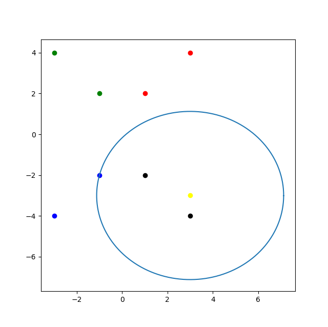
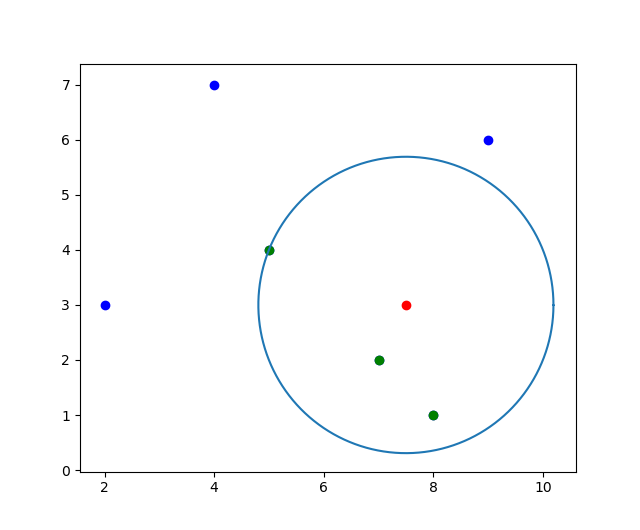

**$k$近邻算法-线性扫描**

```python
import numpy as np
import matplotlib.pyplot as plt


class Knn(object):
    def __init__(self):
        self.k = 3

    def distance(self, x1, x2):
        return np.sqrt(np.sum(np.square(x1 - x2)))
    
    def argmax(self, count):
        max = 0
        label = 0
        for key in count:
            if max < count[key]:
                max = count[key]
                label = key
        return label

    def test(self, x_test, x_train, y_train, count):
        dist_label = []
        for i in range(y_train.size):
            dist = self.distance(x_train[i], x_test)
            dist_label.append([dist, y_train[i]])
        dist_label.sort(key = lambda dist_label: dist_label[0])

        for i in range(self.k):
            c = dist_label[i][1]
            count[c] = count[c] + 1
        y_test = self.argmax(count)
        return y_test


if __name__ == "__main__":
    model = Knn()
    x_train = np.array([[1, 2], [3, 4], [-1, 2], [-3, 4],
                        [-1, -2], [-3, -4], [1, -2], [3, -4]])
    y_train = np.array([1, 1, 2, 2, 3, 3, 4, 4])
    c = np.array([1, 2, 3, 4])
    count = {c[0]: 0, c[1]: 0, c[2]: 0, c[3]: 0}
    x_test = np.array([3, -3])
    y_test = model.test(x_test, x_train, y_train, count)
    print(y_test)
```

**输出**

```
x_test=[ 3 -3]
y_test=4
```



**kdtree-knear**

```python
import numpy as np
import heapq as hq
import matplotlib.pyplot as plt


class Node:
    def __init__(self, data, split, left=None, right=None):
        self.data = data
        self.split = split
        self.left = left
        self.right = right


class KDTree:
    def __init__(self, data):
        k = data.shape[1]  # 数据的维数

        i = 0
        # 递归生成kd树

        def dfs(dataset, split):
            if len(dataset) == 0:
                return None
            # 根据split维对dataset进行排序
            dataset = sorted(dataset, key=lambda x: x[split])
            # 计算中位数对应的序号，//表示整除，/表示浮点除
            mid = len(dataset) // 2
            # 当前节点数据
            dat = dataset[mid]
            # 递归生成子树
            return Node(dat, split, dfs(dataset[:mid], (split + 1) % k), dfs(dataset[mid + 1:], (split + 1) % k))
        self.root = dfs(data, 0)

    # 中序遍历输出
    def inorder(self, node):
        if node != None:
            self.inorder(node.left)
            print(node.data)
            self.inorder(node.right)

    def nearest(self, target, near_k):
        # 创建最小堆,堆元素初始化为负无穷
        # 距离越大,距离的负数越小,所以堆顶为最大距离
        self.knn = [(-np.inf, None)] * near_k

        def dfs(node):
            if node != None:
                # 查找包含target的叶子结点
                if target[node.split] < node.data[node.split]:
                    dfs(node.left)
                else:
                    dfs(node.right)
                # 计算target与当前node的距离
                curr_dis = np.linalg.norm(target - node.data, 2)
                # -dist加入最小堆
                hq.heappushpop(self.knn, (-curr_dis, node))
                # 如果以target为球心的最大超球体半径大于target到切分面距离
                if - self.knn[0][0] > abs(target[node.split] - node.data[node.split]):
                    # 遍历node的另一侧子结点
                    if target[node.split] < node.data[node.split]:
                        dfs(node.right)
                    else:
                        dfs(node.left)
        dfs(self.root)
        # 画超球体
        theta = np.arange(0, 2*np.pi, 0.01)
        x = target[0] + - self.knn[0][0] * np.cos(theta)
        y = target[1] + - self.knn[0][0] * np.sin(theta)
        plt.plot(x, y)
        
        near_k_data = np.array(
            [i[1].data for i in hq.nlargest(near_k, self.knn)])
        return near_k_data


if __name__ == "__main__":
    data = np.array([[2, 3], [5, 4], [9, 6], [4, 7], [8, 1], [7, 2]])
    kdtree = KDTree(data)
    # kdtree.inorder(kdtree.root)
    target = np.array([7.5, 3])
    near_k_data = kdtree.nearest(target, 3)
    plt.scatter(data[:, 0], data[:, 1], c='b', marker='o')
    plt.scatter(target[0], target[1], c='r', marker='o')
    plt.scatter(near_k_data[:, 0], near_k_data[:, 1], c='g', marker='o')
    plt.show()
```

**输出**

