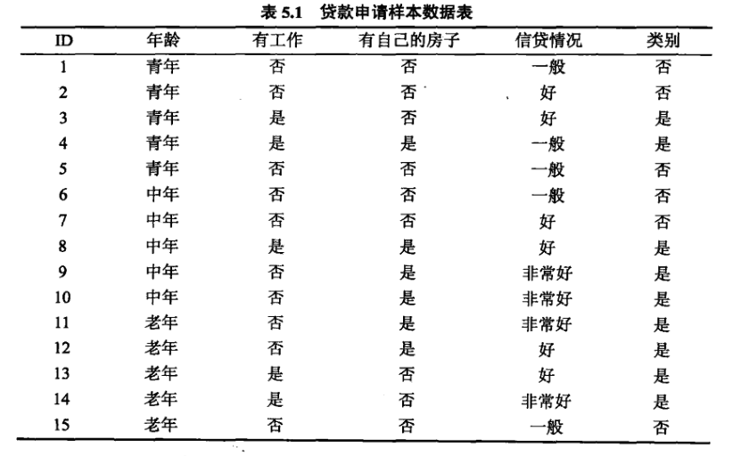
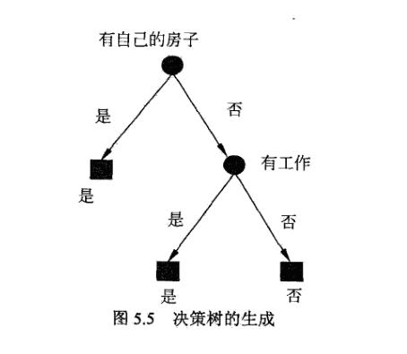

**5-2.决策树的生成**

**1.ID3决策树生成算法**

+ ID3生成过程：
  + ①从根结点开始，对结点计算所有可能特征的信息增益，选择信息增益最大的特征作为结点的特征，由该特征的不同取值建立子结点。
  + ②再对子结点递归地调用以上方法，构建决策树。
  + ③直到所有特征的信息增益均很小或者没有特征可以选择为止。
+ 结论：ID3生成算法等价极大似然估计进行模型选择。

+ 例题：给定表中训练集，使用ID3生成决策树。

  
  $$
  公式:\\
  H(D)=-\sum_{k=1}^{K} \frac{\left|C_{k}\right|}{|D|} \log _{2} \frac{\left|C_{k}\right|}{|D|}\\
  H(D | A)=\sum_{i=1}^{n} \frac{\left|D_{i}\right|}{|D|} H\left(D_{i}\right)=-\sum_{i=1}^{n} \frac{\left|D_{1}\right|}{|D|} \sum_{k=1}^{K} \frac{\left|D_{k}\right|}{\left|D_{i}\right|} \log _{2} \frac{\left|D_{k}\right|}{\left|D_{1}\right|}\\
  g(D, A)=H(D)-H(D | A)\\
  $$
  ①计算每个特征的信息增益$g(D|A)$，选择最大信息增益对应的特征作为根节点的特征。
  $$
  H(D)=0.971\\
  g(D|A_1)=0.083\\
  g(D|A_2)=0.324\\
  g(D|A_3)=0.420\\
  g(D|A_4)=0.363\\
  分割特征为A_3
  $$
  ②$A_3$特征将数据集划分为两个子集$D_1(A_3=Yes)$和$D_2(A_3=No)$。

  因为$D_1$只有同一类样本点，所以它成为一个叶结点，结点的类标记为$Yes$。

  对于$D_2$需要从$A_1,A_2,A_4$里面选择新的分割特征。
  $$
  g(D_2,A_1)=0.251\\
  g(D_2,A_2)=0.918\\
  g(D_2,A_4)=0.474\\
  分割特征为A_2
  $$
  ③$A_2$将数据集$D_2$分割为两个子集$D_3(A_2=Yes)$和$D_4(A_2=No)$。

  ④画出决策树

  

**2.C4.5决策树生成算法**

根据信息增益比选择特征。

**5-3.决策树的剪枝**

+ 剪枝：将已生成的树进行简化的过程，一般通过极小化决策树整体的损失函数实现。

+ 树$T$的叶结点个数为$|T|$
+ 树$T$的的叶结点为$t$
+ 叶结点$t$的样本点数量为$N_t$
+ 叶结点$t$的第$k$类样本点数量为$N_{tk}$
+ 叶结点$t$上的经验熵为$H_{t}(T)=-\sum_\limits{k=1}^{K} \frac{N_{d}}{N_{t}} \log \frac{N_{t k}}{N_{t}}$
+ 参数$\alpha\geq0$
+ 决策树的损失函数为$C_{\alpha}(T)=\sum_\limits{t=1}^{T} N_{t} H_{t}(T)+\alpha|T|$

+ 决策树损失函数可以记为$C_{\alpha}(T)=C(T)+\alpha|T|$，其中$C(T)=\sum_\limits{i=1}^{T} N_{t} H_{t}(T)=-\sum_\limits{i=1}^{T} \sum_\limits{k=1}^{K} N_{t k} \log \frac{N_{t k}}{N_{t}}$

+ 模型对训练数据的预测误差为$C(T)$

+ 模型的复杂度为$|T|$

+ 结论：决策树生成只考虑提高信息增益对训练数据拟合(局部)，决策树剪枝考虑了减小模型复杂度(整体)。决策树剪枝利用损失函数最小的原则等价于正则化的极大似然估计的模型选择。

  