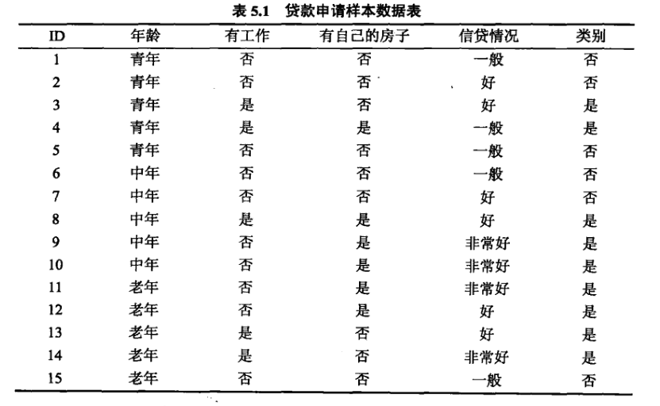

**5-3.Cart算法**

+ Cart算法：Classification and regression tree，分类与回归树算法。

+ Cart学习方法：给定输入随机变量$X$条件下输出随机变量$Y$的条件概率分布。
+ Cart算法组成：
  + 决策树生成：使用训练数据集生成决策树。
  + 决策树剪枝：使用验证数据集对决策树剪枝。

**1.Cart生成**

+ 回归树：平方误差最小化准则
  $$
  \min _{j, s}\left[\min _{c_{1}} \sum_{x_i \in R_{i}(j, s)}\left(y_{i}-c_{1}\right)^{2}+\min _{c_{2}} \sum_{i \in R_{2}(j, s)}\left(y_{i}-c_{2}\right)^{2}\right]
  $$

+ 分类树：基尼指数最小化准则。

+ 特征$A$的条件下，集合$D$的基尼指数定义为$\operatorname{Gini}(D, A)=\frac{\left|D_{1}\right|}{|D|} \operatorname{Gini}\left(D_{1}\right)+\frac{\left|D_{2}\right|}{|D|} \operatorname{Gini}\left(D_{2}\right)$
+ 集合$D$的基尼指数为$\operatorname{Gini}(D)=1-\sum_\limits{k=1}^{K}\left(\frac{\left|C_{k}\right|}{|D|}\right)^{2}$
+ 集合$D$中属于第$k$类的样本子集为$C_k$
+ 类的个数为$K$

+ 例题：根据表所给的训练数据集，应用Cart算法生成决策树。

  

  + ①计算每个特征的基尼指数，选择最优特征及其最优切分点。
    + $A_1,A_2,A_3,A_4$表示年龄、有工作、有自己的房子和信贷情况。

  $$
  \begin{array}{l}
  \operatorname{Gini}\left(D, A_{1}=1\right)=0.44 \\
  \operatorname{Gini}\left(D, A_{1}=2\right)=0.48 \\
  \operatorname{Gini}\left(D, A_{1}=3\right)=0.44
  \end{array}\\
  \begin{array}{l}
  \operatorname{Gini}\left(D, A_{2}=1\right)=0.32 \\
  \operatorname{Gini}\left(D, A_{3}=1\right)=0.27
  \end{array}\\
  \begin{aligned}
  &\operatorname{Gini}\left(D, A_{4}=1\right)=0.36\\
  &\operatorname{Gini}\left(D, A_{4}=2\right)=0.47\\
  &\operatorname{Gini}\left(D, A_{4}=3\right)=0.32
  \end{aligned}\\
  第一个最优特征为A_3，最优切分点为A_3=1;
  \\
  第二个最优特征为A_2，最优切分点为A_2=1;
  $$

  + ②画出决策树

    

**2.Cart剪枝**

从决策树的底端剪去一些子树，使决策树变简单，从而对未知数据由更准确的预测。